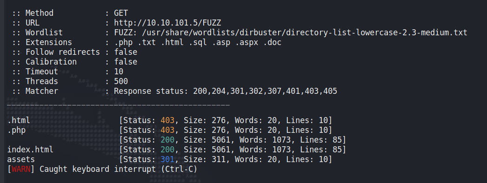
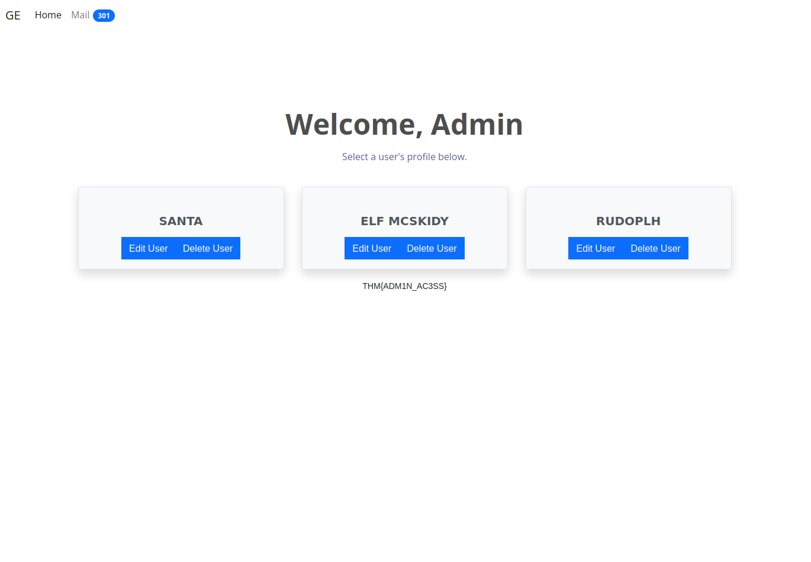

## Day 3

Although we managed to get into the monitoring dashboard, we also need to get into the admin panel. How do we do that without a password?

> Grinch Enterprises have also tried to block communication between anyone at the company. They've locked everyone out of their email systems and McSysAdmin has also lost access to their admin panel. Can you find the admin panel and help restore communication for the Best Festival Company.

Our first question:

> Using a common wordlist for discovering content, enumerate http://10.10.101.5 to find the location of the administrator dashboard. What is the name of the folder? 

The first step is to fuzz for directories. Because we're in a private CTF network, let's absolutely hose it with `ffuf` on 500 threads:

    ffuf -c -u http://10.10.101.5/FUZZ -w /usr/share/wordlists/dirbuster/directory-list-lowercase-2.3-medium.txt -e .php,.txt,.html -ic -t 500 

Hmmmm, I would've expected it to pick up something like "admin" right away. This is why you have to be careful with too many requests at once. Let's lower the number of threads to 100 and also get rid of our extensions given we're just looking for a folder:

    ffuf -c -u http://10.10.101.5/FUZZ -w /usr/share/wordlists/dirbuster/directory-list-lowercase-2.3-medium.txt -ic -t 100 

There we go, first result. We get a custom login form, nothing fancy:

Seeing these is usually a great sign that you'll be able to bypass authentication. A basic HTML login form has more often than not been thrown together by a developer just to provide some basic authentication. It usually hasn't had the testing and security design of a commercial web app -- and even commercial web apps have holes poked in them daily. Usually when I see something like this, I go straight for testing basic creds and SQL injection. We can stick to the former given the question:

> In your web browser, try some default credentials on the newly discovered login form for the "administrator" user. What is the password?

I try a couple:

    admin:admin
    admin:administrator
    admin:password
    root:password
    administrator:admin

But I quickly notice that the page is giving me an invalid login notice without any kind of page refresh. This suggests it might be doing its password checking on the client side rather than sending my passwords to the server for validation. If that's the case, we can probably find the password inside the source code itself.  

If we hit F12 to bring up our browser developer tools and go to the debugger tab, we can see there's a Javascript file in admin/assets/js called "login-page.js". Here are the contents:

Perfect. The script tells us which username:password combo it's looking for with this line:

    if (username === "administrator" && password === "administrator") 

But it also gives us the name of the page it will redirect to after we put in our credentials:

    dc7161be3dbf2250c8954e5.html

Because this is a random string instead of something like "admin-panel.html", I'm guessing the developer was trying to hide it from the very directory fuzzing we did in the first step. Which might mean we don't even need to log in, we can navigate straight to it, and the developer was relying on the obscurity of its name to hide it.  

How about that. We can see the answer for the third question right in front of us:

> Access the admin panel. What is the value of the flag?

Now we're free to wreak havoc.  

