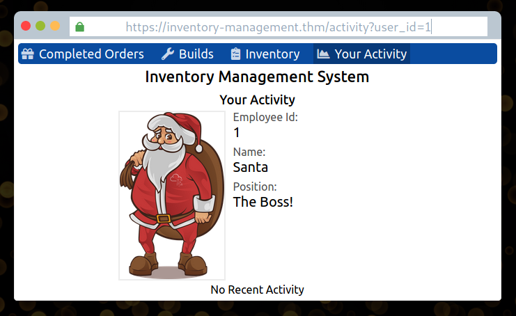
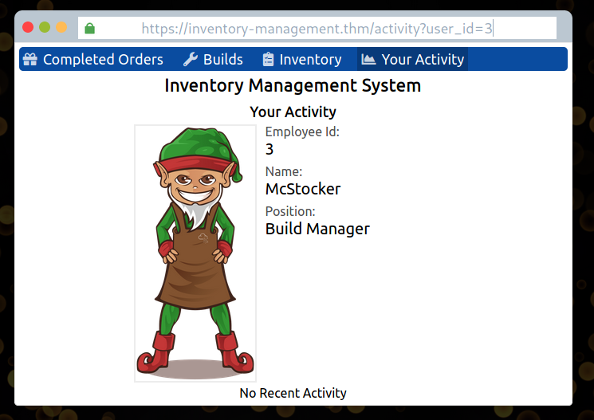
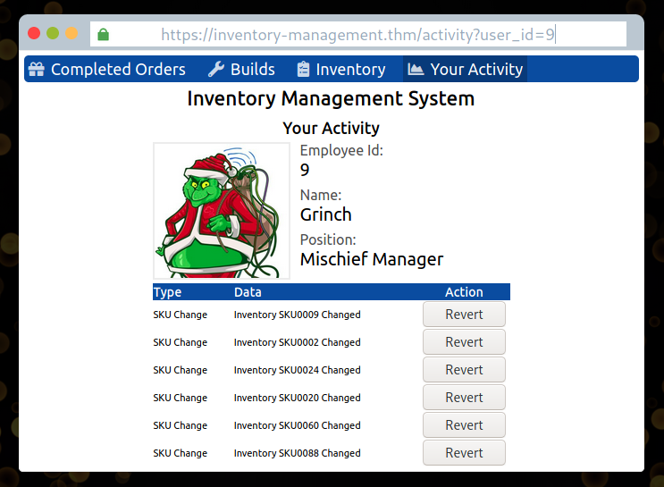

## Day 1

Dear lord, something's gone wrong with the toy-making machine:

> The inventory management systems used to create the gifts have been tampered with to frustrate the elves. It's a night shift, and McStocker comes to McSkidy panicking about the gifts all being built wrong. With no managers around to fix the issue, McSkidy needs to somehow get access and fix the system and keep everything on track to be ready for Christmas!

Good old IDORs. While the perception of hacking is that it's using elite cyberweapons to crack ultra-powerful encryption and steal the President's jewels, a TON of it is about abusing the inherent trust of the internet. Yeah, you might not THINK of the internet as a trustworthy place, but its underlying systems are. When they were built, the designers weren't thinking suspiciously. They basically assumed everyone would use these systems as they were intended. And even as new systems are developed today, that mindset persists. It's heartwarming. It also makes our jobs a lot easier.  

With Insecure Direct Object References (IDORs), a website chooses what to display on a page based on a parameter passed in the URL. On the website we're pentesting today...

...we can see on the Your Activity tab that it looks for a user ID in the URL and displays that user's information. When we click on it, the user_id=11. 

But we have full control over the URL, so what if we changed it to user_id=1? Would we get the first user to register?

And there's the answer to the first question:

> After finding Santa's account, what is their position in the company?

What about the second:

>After finding McStocker's account, what is their position in the company?

Again let's try a few different user_ids. 2 doesn't work, but 3 does.

Next:

> After finding the account responsible for tampering, what is their position in the company?

Huh. I guess let's just keep trying different numbers. If there were potentially a LOT of users, we might write a script for this, but let's assume it's going to be a user_id between 3 and 11. Once we get to user_id=9...

And helpfully, The Grinch has left big "Revert" buttons next to all the destructive changes he's made, so we can save the toy-making machine. 