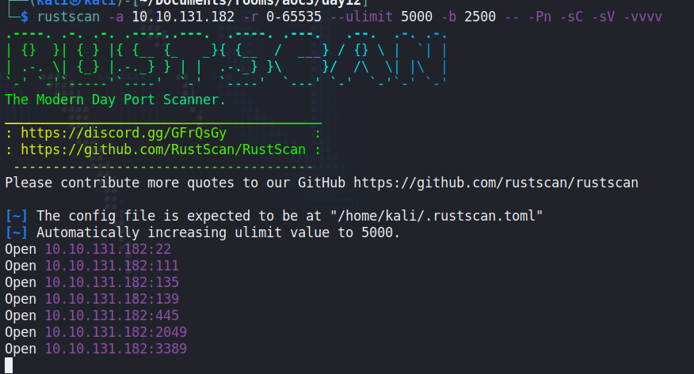
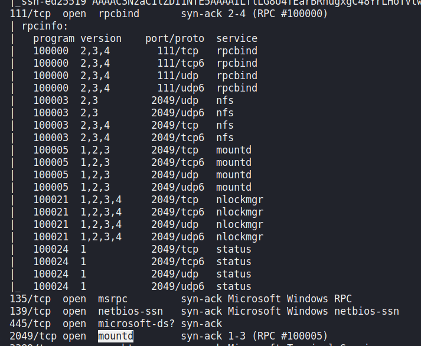
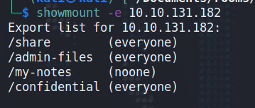

## Day 12

Today is light on story which, let's be honest, is what we're here for. But let's take what we can get.  

> Grinch Enterprises has been leaving traces of how their hackers have been accessing data from the system - you’ve found a unique server they use. We need your help to find out what method they’ve been using to extract any data.

> We have noticed that 10.10.131.182 is generating unusual traffic. We highly suspect that Grinch Enterprises are using it to access our data. We will use Nmap to discover the services are running on their server.

Peeking ahead a bit, today's topic is actually NFS, the Network File System. This is another way of sharing files over a network, so if you ever stumble on one, you better know how to exploit it. It might have something *really juicy.*  

We'll scan the server with `rustscan` and try answering the first couple questions:

    rustscan -a 10.10.131.182 -r 0-65535 --ulimit 5000 -b 1250 -- -Pn -sC -sV -vvvv

> How many TCP ports are open? 

Looks like 7 to me.  

> In the scan results you received earlier, you should be able to spot NFS or mountd, depending on whether you used the -sV option with Nmap or not. Which port is detected by Nmap as NFS or using the mountd service?  

We can see from the scan that port 2049 is the 'mountd' port, but nmap also lists what's being mapped to that port via the port 111 service. Often you might see "rpcbind", "mountd" and "status" which are of limited use to us, but when we see "nfs" in that right hand column, it means shares.  

Once we've found NFS running, we can enumerate the shares available with:

    showmount -e [IP]

We can see four shares, three of which are available without authentication (the "(everyone)" shares.) We'll mount on on our machine so we can access it:

    sudo mount 10.10.131.182:/share /mnt/data 

If we do `ls /mnt/data` now we'll see the contents of the shared folder: two text files:

    132-0.txt
    2680-0.txt

One is The Art Of War by Sun Tzu and the other is Meditations by Marcus Aurelius. We love a Stoic, don't we?  

So that wasn't that interesting. Let's try another share. First we unmount the existing share from our local folder, /mnt/data:

    sudo umount /mnt/data  

Then we'll mount the "confidential" share to /mnt/data

    sudo mount 10.10.131.182:/confidential /mnt/data

Now if we `ls /mnt/data` we can see a folder called "ssh" with two files inside:

    id_rsa
    id_rsa.pub

This is an SSH key pair. "id_rsa" is a private key and "id_rsa.pub" is a public key. The private key SHOULD be kept secret while the public key would sit on a computer you want to connect to. The two keys are generated together and mathematically linked in such a way that the private key can't be deduced from the public key -- a pretty nifty bit of cryptography. This is used to demonstrate authenticity. If I have the private key to a system where the related public key is stored, that's frequently a big green light that I'm allowed into that system. So someone's private key just sitting on an open NFS share like this? That's a huge problem.  

