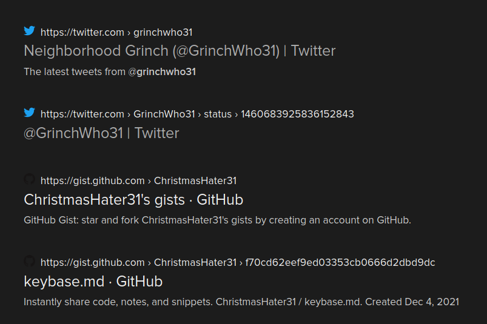
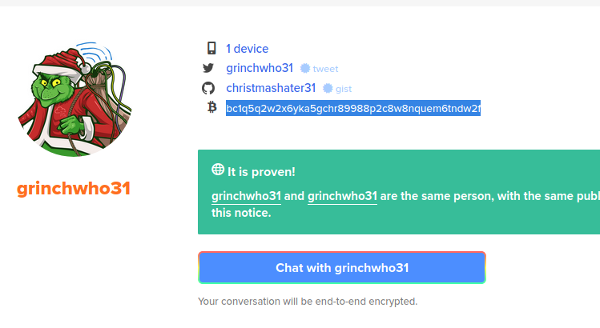
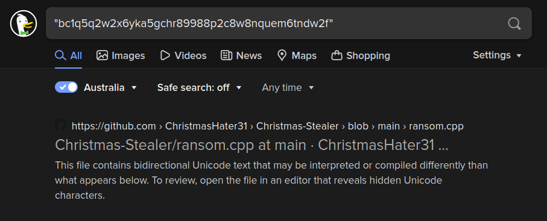
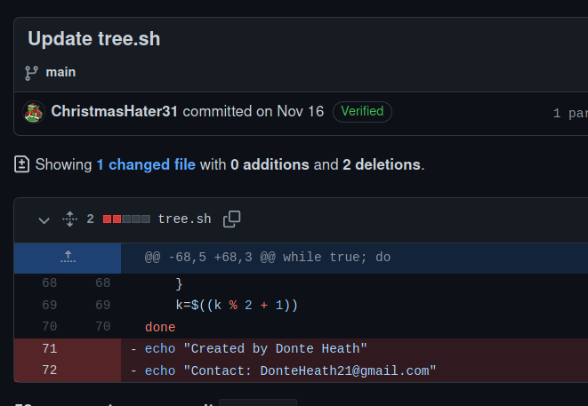

## Day 16

Let's test the Grinch's OPSEC.  

> Grinch Enterprises has decided to use the best festival company to try their new ransomware service. While they think that this is a great proving ground, McSkidy is adamant to determine their goals and share them with the wider security community - can you use your open source intelligence methods to find out more information about their ransomware gang!

OSINT. Open source intelligence. If you've ever used a dating app in your life, you're probably familiar with this -- trying to find out as much as you can about someone using everyone's favourite hacker tool, the humble search engine.  

Let's dive in with this ransomware note from the Grinch Enterprises gang:

    !!! ВАЖНЫЙ !!!
S
    Ваши файлы были зашифрованы Гринчем. Мы используем самые современные технологии шифрования.

    Чтобы получить доступ к своим файлам, обратитесь к оператору Grinch Enterprises.

    Ваш личный идентификационный идентификатор: «b288b97e-665d-4105-a3b2-666da90db14b».

    С оператором, назначенным для вашего дела, можно связаться как "GrinchWho31" на всех платформах.

Let's chuck this into Google Translate.  

    !!! IMPORTANT !!!

    Your files were encrypted by the Grinch. We use the most advanced encryption technology.

    Contact your Grinch Enterprises operator to access your files.

    Your personal ID is “b288b97e-665d-4105-a3b2-666da90db14b”.

    The operator assigned to your case can be contacted as "GrinchWho31" on all platforms. 

And start answering some questions.  

> What is the operator's username?

It looks like it'll be "GrinchWho31".  

> What social media platform is the username associated with?

Let's throw that username into DuckDuckGo. We get a couple of interesting links to both Twitter and GitHub:

> What is the cryptographic identifier associated with the operator?

If we check that second link, to a tweet, we see the Grinch verifying themselves on [Keybase](https://keybase.io). This is one of Keybase's primary functions, trying social media identities to public keys. The unique string Keybase gives a user to do that is our answer: 1GW8QR7CWW3cpvVPGMCF5tZz4j96ncEgrVaR

> What is the bitcoin address of the operator?

We can see that on Keybase.  

    bc1q5q2w2x6yka5gchr89988p2c8w8nquem6tndw2f

> What platform does the operator leak the bitcoin address on? 

How are we meant to find this? Look at EVERY platform the Grinch is on? Nah, let's just DDG the string. We'll wrap it in quotes to make it search for the exact string:

    "bc1q5q2w2x6yka5gchr89988p2c8w8nquem6tndw2f"

We see the platform is GitHub. The code in this repo is actually C++ sample code from the meme site Hacker Typer but it looks like when it was copy/pasted, it removed some of the formatting/spacing; nothing here would actually run ("returnNULL" isn't a function in any language I've ever seen!)

> What is the operator's personal email? What is the operator's real name?

Let's have a look at the Grinch's other repo: [ChristBASHTree](https://github.com/ChristmasHater31/ChristBASHTree). It's a shell script with nothing much interesting inside. But we can click on the commits to see a list of updates the Grinch has made to the project since starting it:

    https://github.com/ChristmasHater31/ChristBASHTree/commits/main

Looking at the most recent one, we can see the Grinch removed some personal details in the latest commit:

    echo "Created by Donte Heath"
    echo "Contact: DonteHeath21@gmail.com"

And that's our OSINT recon done for today. 