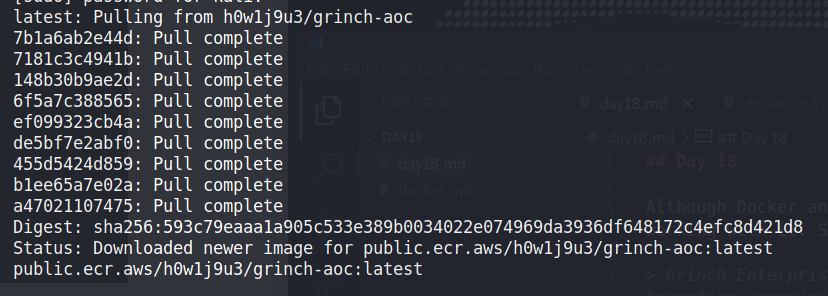

## Day 18

Although Docker and containerisation has changed the modern software landscape, I don't have a ton of experience working with it. So let's dive in and hopefully learn something new.  

> Grinch Enterprises has been gloating about their attack on an underground forum. We know they were specifically targeting organizations in a campaign they've themed "Advent of Cyber" (AOC) - what a frustrating coincidence. Tracing the user back over time - we also encountered a reference to using AWS Elastic Container Registry (ECR) to store container images they use as infrastructure in their attacks. Let's see if we can find out more about the attack tooling Grinch Enterprises is using.

First let's pull down the Docker image:

    docker pull public.ecr.aws/h0w1j9u3/grinch-aoc:latest

And then run it:

    docker run -it public.ecr.aws/h0w1j9u3/grinch-aoc:latest

We get put into a shell inside the docker image. We're logged in as "newuser" and the working directory is basically empty.  

From here if we run `printenv` we see the Grinch defined an environment variable called "api_key":

    api_key=a90eac086fd049ab9a08374f65d1e977 

Now let's save our image as a .tar:

    docker save -o aoc.tar public.ecr.aws/h0w1j9u3/grinch-aoc:latest

Once we extract this:

    tar -xf aoc.tar

We get a bunch of files and directories. If we do `cat manifest.json` we can see some metadata about the container. For example, the Config file:

    "Config": "f886f00520700e2ddd74a14856fcc07a360c819b4cea8cee8be83d4de01e9787.json",

If we cat this file out we can see a list of commands the Docker daemon runs in setting up the image. Here's an interesting one:

    "created_by": "/bin/sh -c git clone https://github.com/hashicorp/envconsul.git root/envconsul/"

We definitely want to look at anything being brought into the root directory. Let's check inside the various layers:

    cd 213c48ef9a7134c0a6215bb1a42cb915a83d89eef736d20ec38f87fa901571ea
    tar -xf layer.tar
    ls

We can check various folders this way that we wouldn't have access to inside the container. We'll keep doing the above process in each layer directory until we get to one that contains the root folder. Inside is another folder, envconsul. This is the one we're looking for. There's a file inside called config.hcl. Let's cat it out and see.  

Inside, there's an important line:

    token = "7095b3e9300542edadbc2dd558ac11fa"

This is the token to access the Grinch's Vault server, a secrets storage utility. And that finishes off today's challenge. A shorty but a goody. 