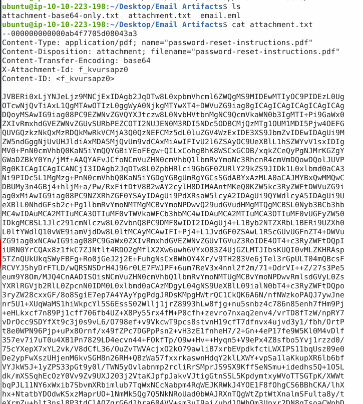
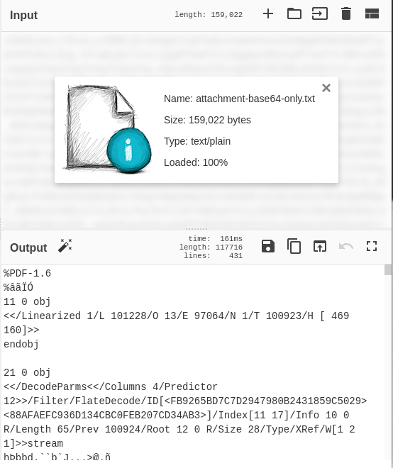
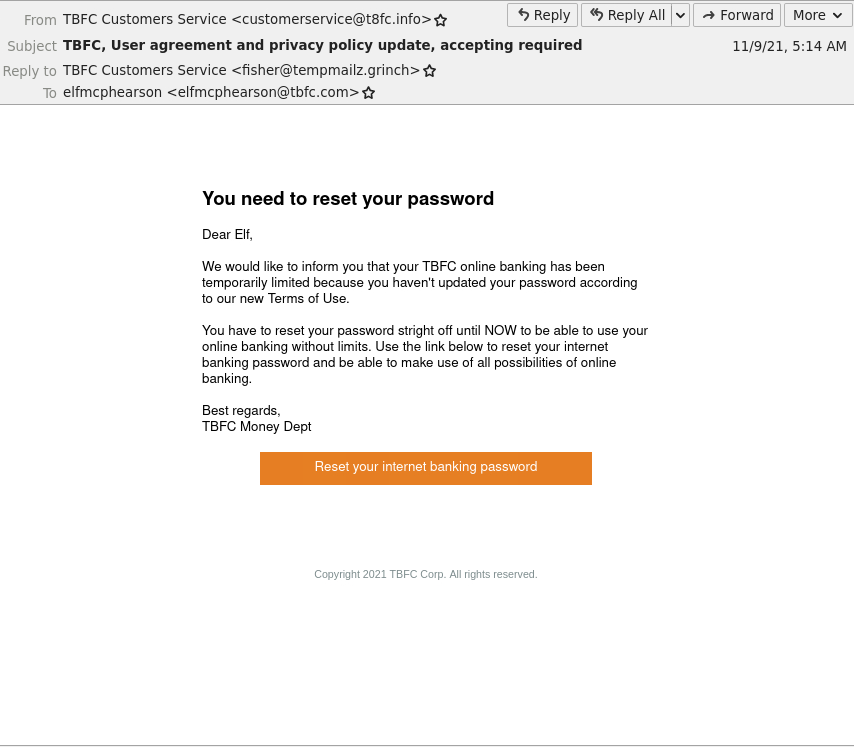
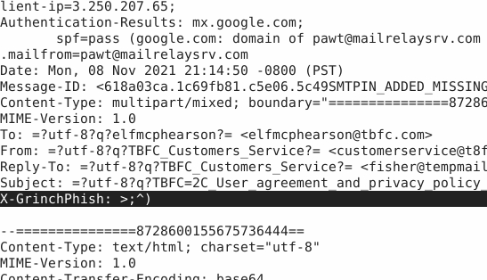

## Day 19

Social engineering attacks are the most devastating. No matter how patched and secured your network is, with IDS at every endpoint and an elite SOC to watch them, none of it'll matter if someone will just let your attacker in through the front door. And phishing, like sending emails designed to trick users into acting on behalf of an attacker, is the most popular of all. Everyone can fall for a phishing attack. InfoSec Twitter is full of some of the smartest experts around also humble enough to admit when they've been conned. Let's learn what to look out for to decrease the chances, at least.  

Here are some tips from TryHackMe:

- Do you know the sender? Does the email address match the sender? Does the reply-to email match the sender?
- In the email body, does the email greet you personally (Hello McSkidy), or is it very generic (Hello Elf)?
- Does the email contain any grammar mistakes, such as misspelled words?
- Does the email give you a sense of urgency where you need to act fast? Such as a deadline to prevent your account from being disabled.
- Does the email contain a link or a clickable button that redirects you to a website? Does the link match the sender, or is it a random website?

Let's spin up the AttackBox and check inside the "Email Artifacts" folder. We're being dropped in the middle of the incident response process; obviously some of our team has narrowed down which email caused an intrusion and now it's for us to figure out what happened. We can cat out "attachment.txt" and see that it looks like someone was sent a PDF called "password-reset-instructions.pdf". There's a bunch of base64 encoded text below.  

Fortunately our team has also given us a file with just the base64, so we can easily decode it:

    cat attachment-base64-only.txt | base64 -d

And then output the data into a PDF:

    cat attachment-base64-only.txt | base64 -d > file.pdf

Or we can put the base64-only into CyberChef. We can see clearly from the header that it's PDF data:

We can also check the email itself in Thunderbird or via the "email.eml" file in the Email Artifacts folder.  

Let's get to the questions.  

> Who was the email sent to? 

Looks like "elfmcphearson@tbfc.com". So some of the elves have job title names and some of them are named after former supermodels? It's a strange culture.  

> Phishing emails use similar domains of their targets to increase the likelihood the recipient will be tricked into interacting with the email. Who does it say the email was from?

Sneaky. Instead of "tbfc.com" the attacker used the domain "t8fc.info"! Someone not paying attention or distracted by the urgency of the email might not notice the difference.  

> Sometimes phishing emails have a different reply-to email address. If this email was replied to, what email address will receive the email response?

We can also see the Reply To address is "fisher@tempmailtz.grinch". Hmmmmmmm. Something doesn't look right.  

> Less sophisticated phishing emails will have typos. What is the misspelled word?

This is a pretty confusing question because there's a LOT here your English teacher would rap your knuckles over. "mailz" for one. "Customers Service" instead of "Customer Service". And the phrashing of: "You have to reset your password stright off until NOW..." which seems clunky at best. Fortunately we can see in that is our answer. What the hell is "stright"?  

> The email contains a link that will redirect the recipient to a fraudulent website in an effort to collect credentials. What is the link to the credential harvesting website?

If you hover over the orange button, you'll see a link preview in Thunderbird to "https://89xgwsnmo5.grinch/out/fishing/". If we check the "email.eml" file we can also find this link by decoding the base64-encoded boxy and looking for the "a href" tag.  

> View the email source code. There is an unusual email header. What is the header and its value?

Looking through the email headers in "email.eml" and what do we have here?

"X-GrinchPhish: >;^)" looks pretty sus.  

> You received other reports of phishing attempts from other colleagues. Some of the other emails contained attachments. Open attachment.txt. What is the name of the attachment?

We know from earlier: it's password-reset-instructions.pdf  

> What is the flag in the PDF file?

If we decoded the base64 text and output it to a PDF file, we can open it in a PDF reader. You'd have to be careful doing something like this because once reconstitutded, opening the PDF could run any malicious payloads it was carrying. Instead it might be a better idea to use `pdftotext` to convert the PDF to text if we're just looking for some content inside. We'll open it anyway here knowing we're safe in the exercise though and we can see the flag is THM{A0C_Thr33_Ph1sh1ng_An4lys!s}  

