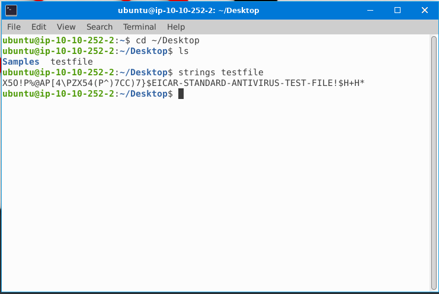
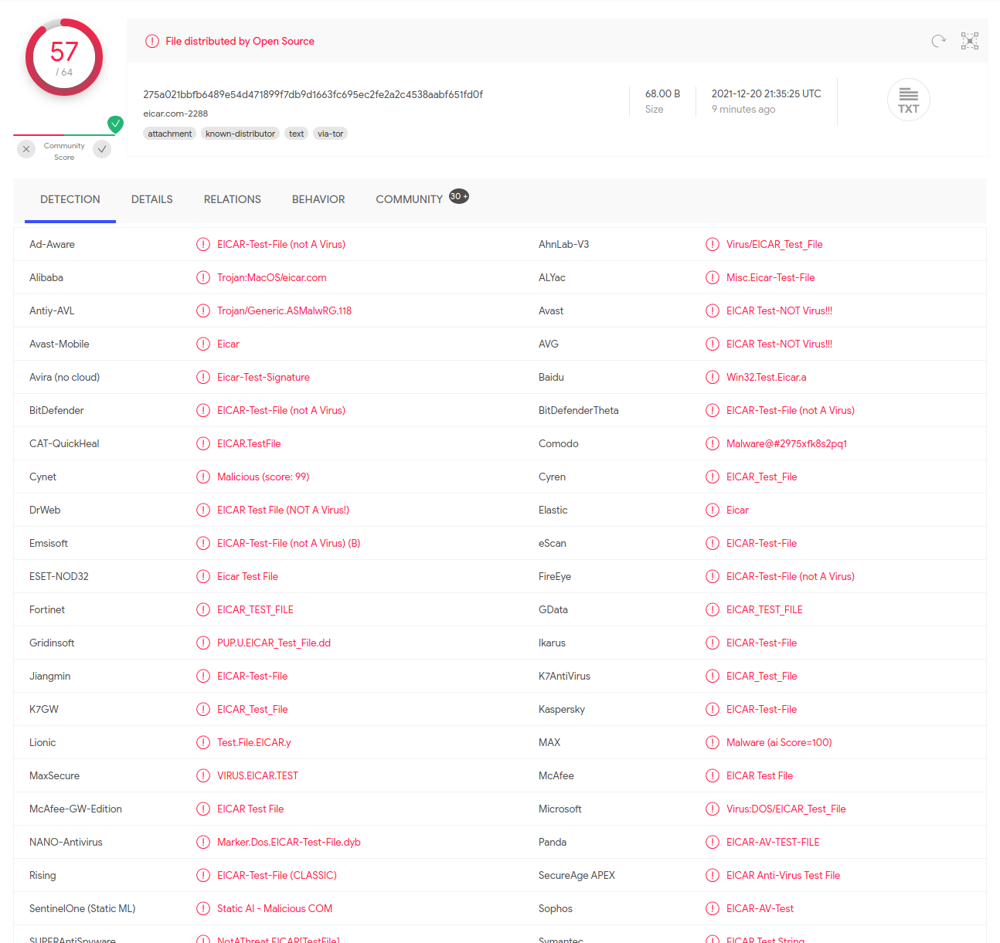

## Day 20

Let's look at today's scenario.  

> McPayroll is processing the bonuses for all the hardworking elves. One of the Elves has sent McPayroll a file that they're claiming contains their updated payment information. The only problem is that she doesn't recognize the Elf - could this be a sneaky attack from Grinch Enterprises to cause more havoc? Analyze the file to see if you can determine whether it's malicious or not!

See, this is the power of education. We JUST did phishing and now Elf McPayroll has noticed a suspicious email and forwarded it to us for investigation before opening. McPayroll, I'm getting you an extra gingerbread cookie at the work Xmas party.  

Let's dive right in.  

>  Open the terminal and navigate to the file on the desktop named 'testfile'. Using the 'strings' command, check the strings in the file. There is only a single line of output to the 'strings' command. What is the output? 

`strings` is a program that extracts strings it can find in a file's data. Often it's a lot of gibberish because it's not strictly text data, but sometimes you can find useful strings inside a program that gives you an idea of what it's trying to do.  

Here we see it finds just one long string.  

    X5O!P%@AP[4\PZX54(P^)7CC)7}$EICAR-STANDARD-ANTIVIRUS-TEST-FILE!$H+H*

> Check the file type of 'testfile' using the 'file' command. What is the file type?

This is just as easy as above, we run:

    file testfile

And it tells us:

    testfile: EICAR virus test files

This tells us it's a specially formed test file designed by the [European Institute for Computer Antivirus Research](https://en.wikipedia.org/wiki/EICAR_test_file) to examine AV software.  

> Calculate the file's hash and search for it on VirusTotal. When was the file first seen in the wild?

VirusTotal is an invaluable resource for seeing what any of the thousands of anti-virus programs have detected or developed signatures for. To calculate our test file's hash, we run:

    md5sum testfile

This gives us a unique identifier for the file based on its contents. We can then search for that hash:

    44d88612fea8a8f36de82e1278abb02f

And see what VirusTotal says.  

Okay! A lot of AV software detects our test file. As it should be, given it's designed for testing AV software detection.  

Navigating to the Details tab on VirusTotal, we can look at its history:

    First Seen In The Wild 2005-10-17 22:03:48
    First Submission 2006-05-22 12:42:02
    Last Submission 2021-12-20 21:35:25
    Last Analysis 2021-12-20 21:35:25 

> Go to [this](https://www.eicar.org/?page_id=3950) link to learn more about this file and what it is used for. What were the first two names of this file?

"ducklin.htm" or "ducklin-html.htm" after its original author. Cute.  

> The file has 68 characters in the start known as the known string. It can be appended with whitespace characters upto a limited number of characters. What is the maximum number of total characters that can be in the file?

Let's look back at that website.  

> The first 68 characters is the known string. It may be optionally appended by any combination of whitespace characters with the total file length not exceeding 128 characters. The only whitespace characters allowed are the space character, tab, LF, CR, CTRL-Z. To keep things simple the file uses only upper case letters, digits and punctuation marks, and does not include spaces. The only thing to watch out for when typing in the test file is that the third character is the capital letter „O“, not the digit zero.

The 68 characters its referring to is the long string we found by running `strings` earlier. So basically we could add another 60 spaces to the file and it'll still be valid.  

That's it for today. A nice little lesson in some basic file analysis.  