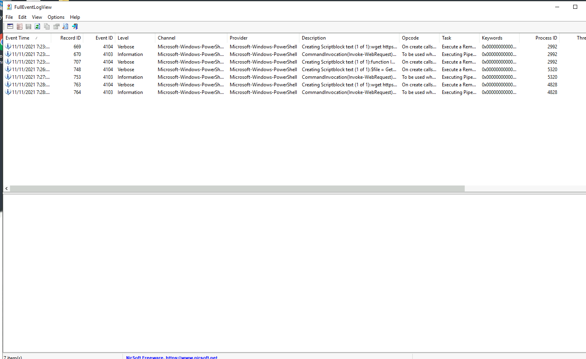
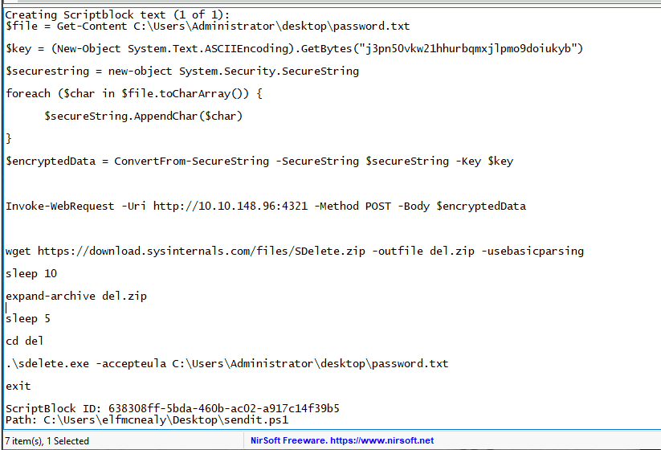

## Day 23

Today we're doing more forensics including recovering a deleted file.  

> One of the administrators with access to the Elf Dome Defense system realized that his password file was missing from his desktop. Without the password, he will not be able to log into the Mission Control panel. McSkidy suspects that perhaps one of the previous phishing attempts was successful. McSkidy jumps into action.

Anyone with a sysadmin tattoo on the dark part of their heart (it's a little # sign) loves looking at logs. Logliness is close to godliness as we can get a view of everything that's happened on a system.  

We're first going to set up the logging tool for this challenge. It's called Full Event Log View, a spin on Windows' classic Event Viewer. We want to show only events that happened between 11/10/2021 and 11/12/2021 at 1:00:52PM, with the event IDs 4103 and 4104 from PowerShell, and we only want events with "HTTP" in the description.  

Once that's set up, Full Event Log View shows us seven logs for us to peruse:

The logs are presented in sequence so we can get an idea of the attacker's path. It looks like it went roughly like this:

1. First, while logged in as Elf McNealy, they downloaded the pure PowerShell implementation of the [PrintNightmare exploit](https://github.com/calebstewart/CVE-2021-1675).
2.  Then they ran the exploit using the Invoke-Nightmare command and added a new user called adm1n (password: P@ssw0rd).  
3. They sent the contents of password.txt to their own webserver at 10.10.148.96:4321  
4. Then they downloaded the Sysinternals tool SDelete to delete password.txt  

Now let's get to our questions.  

>  What command was executed as Elf McNealy to add a new user to the machine? 

That'd be Invoke-Nightmare, used to run the PrintNightmare script.  

> What user executed the PowerShell file to send the password.txt file from the administrator's desktop to a remote server?

The default username inside the PrintNightmare script is "adm1n"  

> What was the IP address of the remote server? What was the port used for the remote connection? (format: IP,Port)

We can see that in event record ID 748:

The attacker is making a POST request to send password.txt to 10.10.148.96:4321.  

> What was the encryption key used to encrypt the contents of the text file sent to the remote server?

In the same event log, we can see at the top this line:

    $key = (New-Object System.Text.ASCIIEncoding).GetBytes("j3pn50vkw21hhurbqmxjlpmo9doiukyb")

So the key is: j3pn50vkw21hhurbqmxjlpmo9doiukyb  

> What application was used to delete the password.txt file?

SDelete.exe. Sysinternals tools are super useful for both sysadmins and attackers, so it's handy to get used to them.  

> What is the date and timestamp the logs show that password.txt was deleted? (format: MM/DD/YYYY H:MM:SS PM)

Let's update our options to include "password.txt" and then check the leftmost column, Event Time. We can see this command:

    .\sdelete.exe -accepteula C:\Users\Administrator\Desktop\password.txt

Ran at 11/11/2021 7:29:27 PM.  

> What were the contents of the deleted password.txt file?

On the Desktop, there's a PowerShell script called decryptor.ps1. Handy! We need to enter some encrypted text and a key. Fortunately from the logs, we have both. So we can try to reconstitute password.txt.  

In log 753, we can see the POST request data sent to the attacker's web server:

    76492d1116743f0423413b16050a5345MgB8AEcAVwB1AFMATwB1ADgALwA0AGQAKwBSAEYAYQBHAE8ANgBHAG0AcQBnAHcAPQA9AHwAMwBlADAAYwBmADAAYQAzAGEANgBmADkAZQA0ADUAMABiADkANgA4ADcAZgA3ADAAMQA3ADAAOABiADkAZAA2ADgAOQA2ADAANQA3AGEAZAA4AGMANQBjADIAMAA4ADYAYQA0ADMAMABkADkAMwBiADUAYQBhADIANwA5AGMAYQA1ADYAYQAzAGEAYQA2ADUAMABjADAAMwAzADYANABlADYAOAA4ADQAYwAxAGMAYwAxADkANwBiADIANAAzADMAMAAzADgAYQA5ADYANAAzADEANAA2AGUAZgBkAGEAMAA3ADcANQAyADcAZgBlADMAZQA3ADUANwAyADkAZAAwAGUAOQA5ADQAOQA1AGQAYQBkADEANQAxADYANwA2AGIAYQBjADAAMQA0AGEAOQA3ADYAYgBkAGMAOAAxAGMAZgA2ADYAOABjADEAMABmADcAZgAyADcAZgBjADEAYgA3AGYAOAA3AGIANQAyAGUAMwA4ADgAYQAxADkANgA4ADMA

This looks like our encrypted text. Let's chuck that and the key we found before into the script and here we go:

We get password.txt back:

    Mission Control: letitsnowletitsnowletitsnow

