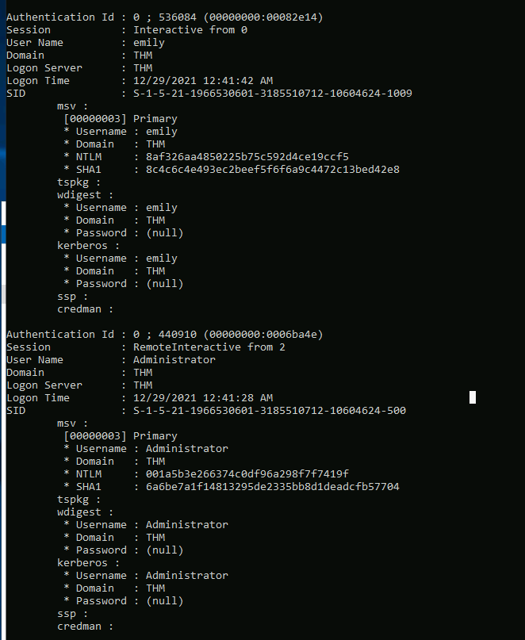

## Day 24

Well folks, here we are. The end of another fantastic Advent of Cyber. It's absolutely wild to think about how much has changed since this time last year, but one thing has stayed the same: nothing is more rewarding than hacking. No matter where you are or how you're feeling, there's always another puzzle to solve and another thing to learn. As long as you can make failure your friend.  

But equally important as learning to fail is learning to celebrate your wins. Congratulations. You made it all the way here.  

> McSkidy has learned a lot about how Grinch Enterprises operates and wants to prepare for any future attacks from anyone who hates Christmas. From a forensics analysis they did, she noticed that the Grinch Enterprises performed some malicious activities. She wants to perform these on the same machine they compromised to understand her adversaries a little better. Can you follow along and help her prepare for any other attacks?

It's gonna be an easy one today: post-exploitation. Microsoft actually just posted an excellent article called the [Lateral Movement Playbook](https://docs.microsoft.com/en-us/defender-for-identity/playbook-lateral-movement) which steps through some of this stuff. Strongly recommend.  

The first thing we're gonna do if we can run `mimikatz` on a Windows machine we've compromised is run:

    sekurlsa::logonpasswords

And see if we can get any NTLM hashes cached in the OS. Looks like we're in luck.  

From here we can either attempt to crack the hash, which we'll do for this challenge, or simply pass the hash using a variety of tools. "Passing the hash" is a technique that, instead of decrypting the hash into the plaintext password, lets us just use the hash as a password instead. It's super useful for moving around a Windows network.  

Let's copy our two hashes:

    8af326aa4850225b75c592d4ce19ccf5
    001a5b3e266374c0df96a298f7f7419f

Into a text file called "aoc-ntlm.txt". TryHackMe's walkthrough uses John The Ripper for cracking these, which is a fine tool. I already have `hashcat` set up on a machine with a big graphics card, so we can use the extra power to make cracking much faster.  

    .\hashcat.exe -m 1000 -a 0 aoc-ntlm.txt rockyou.txt -r OneRuleToRuleThemAll.rule -w 4 -O -D 1,2

Let's walk through this command:

.\hashcat.exe - Run hashcat.exe
-m 1000 - Use mode 1000, which is for NTLM hashes
-a 0 - Use attack mode 0, which is just a dictionary attack
aoc-ntlm.txt - This is our file with the hashes
rockyou.txt - This is our wordlist, a giant list of potential passwords
-r OneRuleToRuleThemAll.rule - This is a bit more complicated. This is basically a giant list of ways that hashcat will mutate the words in rockyou.txt. Using a rulelist with hashcat means you can give it a smaller wordlist and hashcat will automatically calculate all kinds of different permutations of each word, so "password" could become "p@ssw0rd", "password1", "password123" etc etc. The OneRuleToRuleThemAll rulelist was actually devised by analysing other rulesets for maximum efficiency. [It's a super interesting read](https://notsosecure.com/one-rule-to-rule-them-all).  
-O - Optimised kernel, makes cracking faster for passwords with <32 characters
-D 1,2 - OpenCL Device Type, basically tells hashcat to crack passwords using both CPU and GPU.  

Give it a second and we get:

    8af326aa4850225b75c592d4ce19ccf5:1234567890
    001a5b3e266374c0df96a298f7f7419f:letmein123!

Now let's get to our final questions.  

>  What is the username of the other user on the system? 

That'd be emily according to mimikatz.  

> What is the NTLM hash of this user?

We see it's 8af326aa4850225b75c592d4ce19ccf5

> What is the password for this user?

Praise be to `hashcat`, it's a very frustrating 1234567890  

