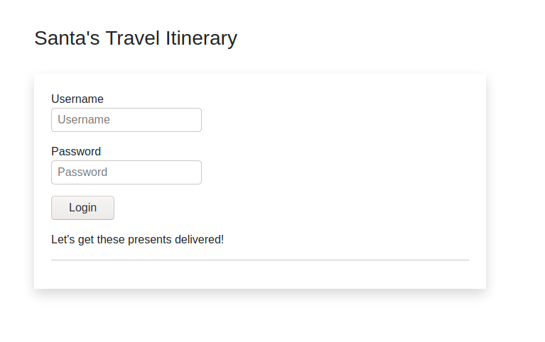
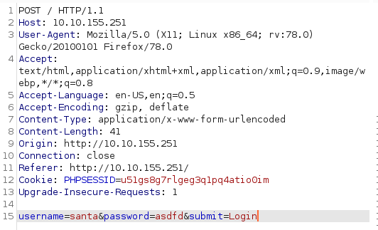
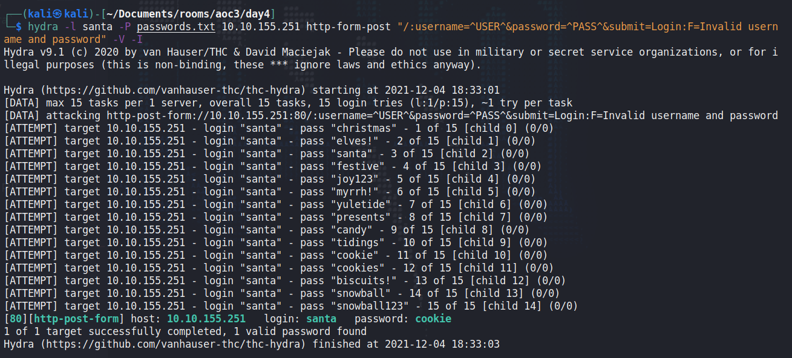
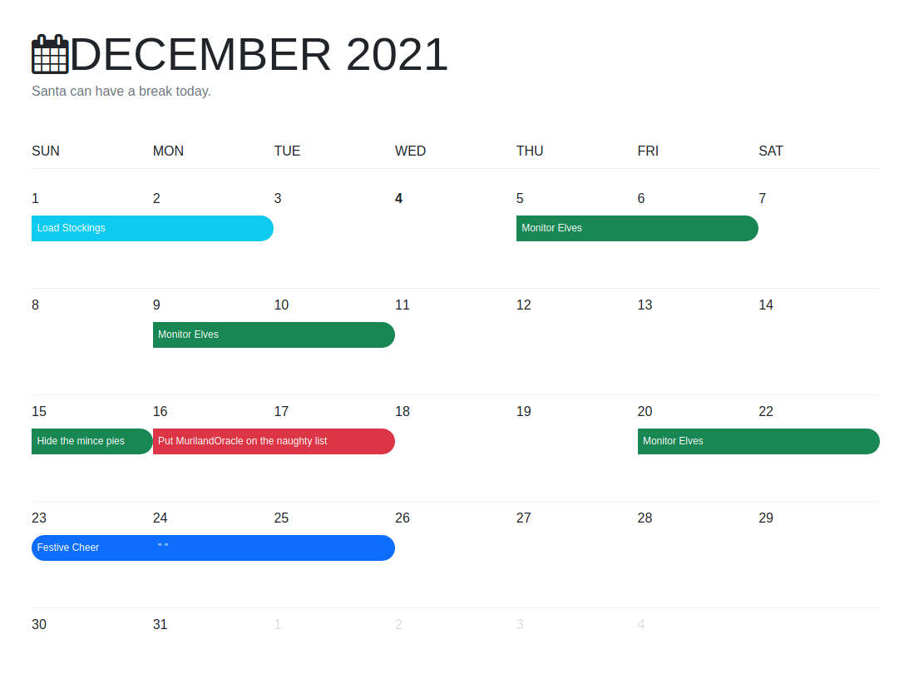

## Day 4
Every systems administrator knows today's struggle:

> McSysAdmin managed to reset everyone's access except Santa's! Santa's expected some urgent travel itinerary for his route over Christmas. Rumour has it that Santa never followed the password security recommendations. Can you use bruteforcing to help him access his accounts?

Enforcing password requirements is hard. A lot of people don't want to remember a jumble of letters and numbers or introduce the friction of using a password manager into their workflow. Password managers are super easy to use these days: they'll generate unique, random, long passwords for any service you use and store them in a browser extension or an app on your phone so they're always there for you. 15 minutes of getting used to the thing for a cryptographically secure lifetime. Not a bad trade. But when you're caught up in deadlines, frantically trying to appease your stakeholders, or trying to balance your social life against the need for you time, finally getting to that book you've been putting off, 15 minutes can seem like a lot. And a password manager probably doesn't seem like it has a lot to do with any of that, so it gets bumped off the priorities list.  

The issue with sacrificing our security to our busyness is often the busiest people are the biggest targets: the C-suite. If Jimdog from Sales reuses "ILoveMyBiceps20" everywhere, that might give an attacker a foothold in your network. Bad! If your CEO is prone to reusing "RachelsABoss", that's entry onto your network, access to some of the company's most sensitive information, and a position of influence from which to launch social engineering attacks on the rest of your employees. I personally know of multiple companies where their password for everything is "[CompanyName]123". This stuff keeps me up at night.  

Today we're bruteforcing passwords, which just means guessing a lot of passwords, ideally quickly, ideally automated. If the password is on a list we provide, we'll get to log in.  

On the website, we see a basic login form like yesterday's:

TryHackMe will walk you through today's attack using Burp Suite, an absolutely invaluable tool, even with its Community edition. Familiarising yourself with Burp's proxy and Repeater functions is massively important. Intruder, though - the tool Burp uses for brute force attacks - majorly sucks in the free Community edition; it's really slow, and in my experience slows down even more depending on the size of your wordlist. Our friend `hydra` on the other hand is the GOAT for brute forcing. We'll use this command:

    hydra -l santa -P passwords.txt 10.10.155.251 http-form-post "/:username=^USER^&password=^PASS^&submit=Login:F=Invalid username and password" -V -I 

To break this down, this says:

-l santa: Using the username "santa"  
-P passwords.txt: And the passwords in this file  
10.10.155.251: Target this IP  
http-post-form: And use the "http-form-post" module for HTTP login brute forcing  
"/: Attack the root page (if the login form was on http://10.10.155.251/login.php, we'd put "/login.php:" instead)  
username=^USER^&password=^PASS^&submit=Login: Send this data to the website. ^USER^ is where hydra will insert our username (santa) and ^PASS^ is where hydra will insert our password guesses (stored in the passwords.txt file)  
F=Invalid username and password: When Hydra sees this, it knows it hasn't got a valid password; this is what the website responds with when we put in the wrong creds.  
-V: Verbose output  
-I: Ignore any previous hydra attempts  

The most complicated part of that is:

    username=^USER^&password=^PASS^&submit=Login

And that string just comes from either intercepting the POST request with Burp when you try to log in, or watching the Network tab of your developer tools on an attempted login and right clicking on the POST request and going "Edit and resend"  

Anyway, hit that `hydra` command and what do we get:

Damn, Santa's password is "cookie". Shocking! Not even "[o0k13"? We get into Santa's itinerary and find out he's kind of a Bezos:

"Monitor Elves"? Uhhhhhhhhhhhhhhh.  

