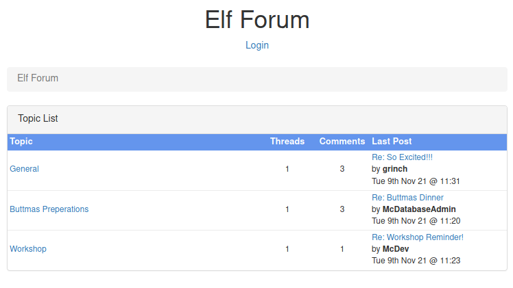
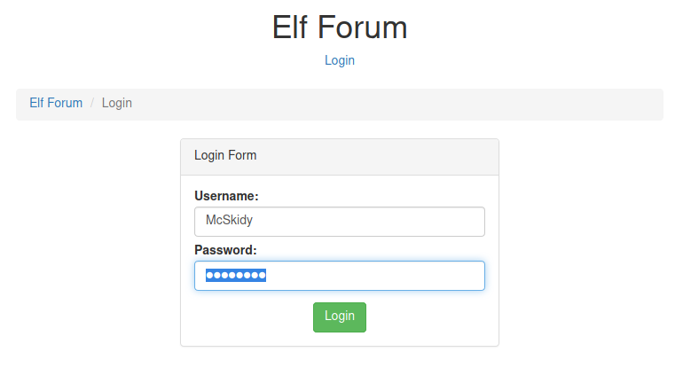
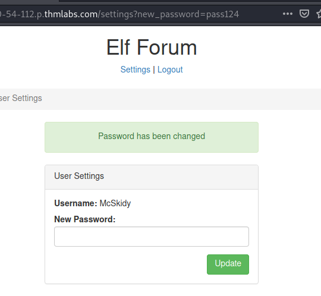
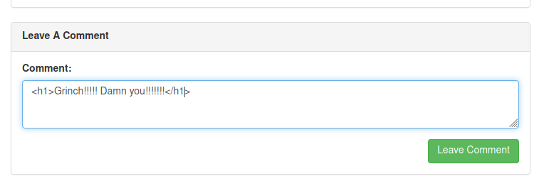
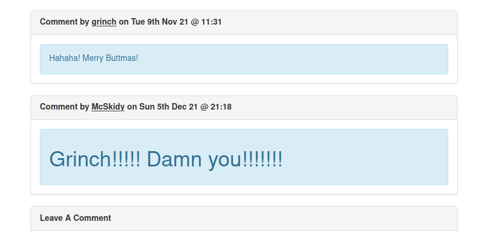
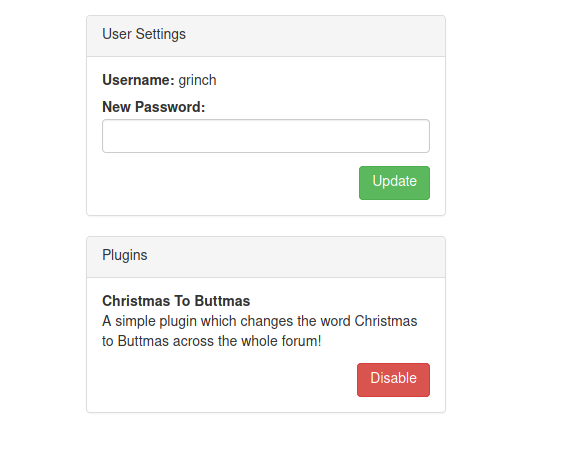

## Day 5

A little hacktivist vandalism today:

> The Elf Forum is where all the elves express their joy and excitement about Christmas, but Grinch Enterprises has one bad admin account, and they've installed a plugin that changes all mentions of Christmas to Buttmas!! McSkidy needs to find that admin account and disable the plugin.

We're doing XSS or Cross-Site Scripting today, a client-side attack that aims to run code in a victim's browser by injecting it into a website. Common targets include comment boxes and other website inputs, but it's ALSO a vector in some MMOs. Recently, Amazon Game Studios' New World had players smashing XSS payloads inside their in-game chat to post things the chat wasn't meant to support (like images) [and even crash other people's games](https://www.nme.com/news/gaming-news/new-world-oversight-allows-players-to-crash-the-game-via-its-chat-box-3083164). OOPS.  

So we visit our first URL and get a messageboard:

Let's login with the creds TryHackMe gives us: McSkidy:password

The first step in any website pentest is manual recon. Use the website like an ordinary user would, test all its functions from the front-end and get a sense of what's available. For example, the reset password function. When I change the password to "pass124" and hit Update, it's reflected in the GET parameter in the URL:

Next, if we go to the messageboard and try posting in one of the threads, we could just type in whatever words we want. But we could also try adding in HTML tags and see if the commenting function filters them out. You could try adding italics or bold to your text, but I like h1 tags so there's no doubt that something wacky's going on with the text:

Great. This means we can probably run HTML and even, more usefully, Javascript inside the browser. Formatting our text with HTML doesn't do much for us, but if we can also inject Javascript into the page, we can start really doing some damage. A common way to test if you can inject Javascript is to use payloads like:

    

Or:

    

But if you really wanna know more, the best place to start is on [PortSwigger](https://portswigger.net/web-security/cross-site-scripting).  

For our part, we're going to use the reset password URL we found before and try to reset the password of any user that visits the page to one we already know:

    

We can test this works by viewing the source code OR by logging out and logging back in with the credentials McSkidy:pass123. Naturally, our payload works on us too.  

Most importantly though, once The Grinch has visited the page, we can log in as him and disable the plugin he installed on the messageboard changing "Christmas" to "Buttmas":

