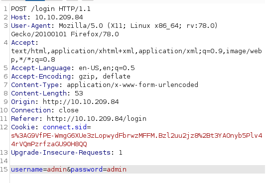
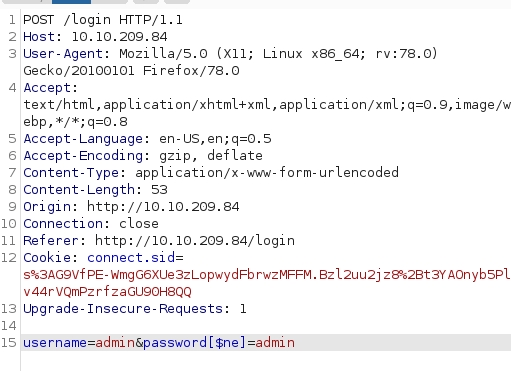
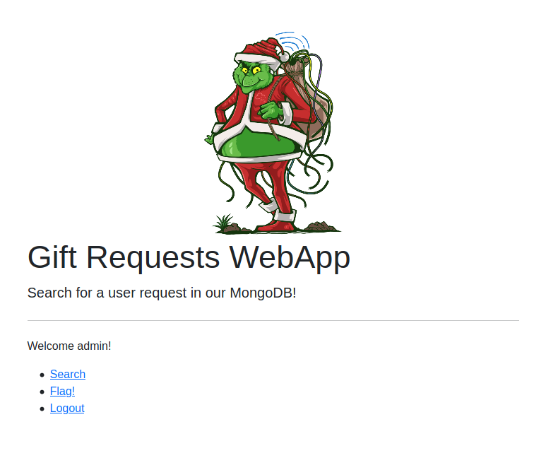
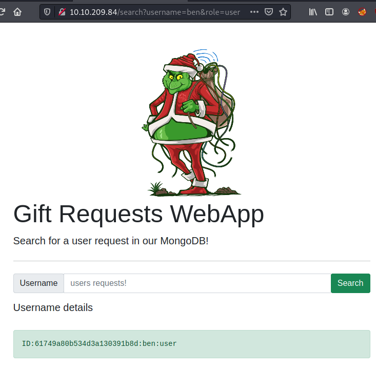
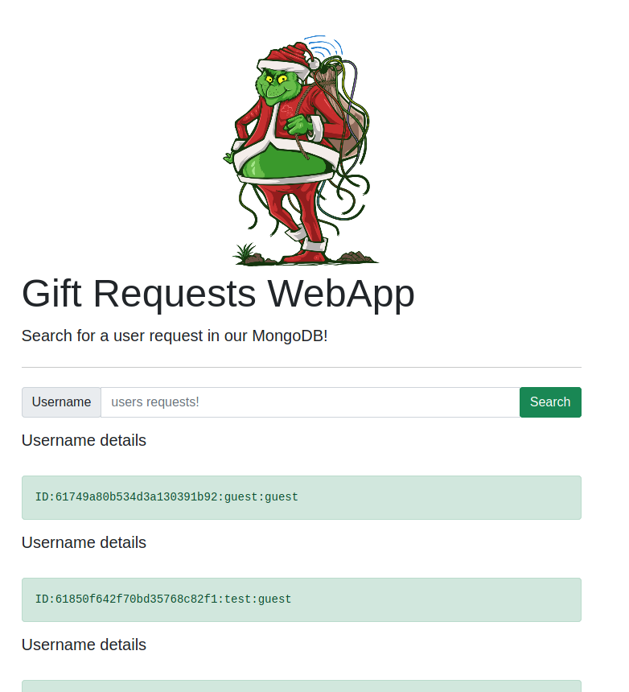

## Day 7

> The development team that handles gift requests from Children migrated over to a new technology stack. In doing so, they left their application vulnerable, and Grinch Enterprises now controls access to the system. Fortunately, Grinch enterprises forgot to patch the system so you can use the same vulnerability to retrieve the gift requests for the students.

It's NoSQL injection time. I'm stoked for it: I'm terrible when it comes to NoSQL. A charlatan. See, think about the databases that power the web in two broad churches: relational and non-relational. In relational databases, stuff gets stored in columns and rows inside a table, each table represents a category of data (like "users" or "posts"), and the tables inside a database can relate to each other, e.g. each user can be tied to all the data for the things they've posted. These have been around and widely used for a long time and I think they're great.  

But non-relational databases, where data is stored in big collections of documents that aren't quite as structured, can have performance gains. On the level of Big Data, those gains are essential. So non-relational databases are now a critical piece of the infrastructure of modern life. Which  means securing them is just as important.  

SQL is a popular language used for querying relational databases. NoSQL refers to everything else (NoSQL i.e. "Not only SQL".) SQL injection typically refers to impacting relational databases. NoSQL injection typically refers to doing the same for non-relational databases. Today, we're learning how to use NoSQL to make some non-relational database admin's day (by illuminating security holes; everyone responds well to that right?)  

First let's SSH into today's machine with the credentials they give us: thm:tryhackme

    ssh thm@10.10.209.84 -p 2222

Now for our first question:  

>  Interact with the MongoDB server to find the flag. What is the flag? 

Running `show databases` we see a `flagdb` database. We can move to it with `use flagdb` and then see what collections it's storing with `db.getCollectionNames()`. That shows a collection called `flagColl`. Let's enumerate that with `db.flagColl.find()` and get our first flag.  

Now for the actual injection part. The NoSQL query we'll be injecting into is `db.users.find({query})` or `db.users.findOne(query)`. We have to know the structure of those to be able to modify them with our injection.  

The actual query will look something like:

    db.users.findOne({username: "admin", password: (query)})

We can try to enter the password as {"$ne": "XYZ"} via the login page but that doesn't give us anything, so let's try intercepting the login request with Burp Suite.  

Here's what the login form is trying to send:

Let's modify it to say:

    username=admin&password[$ne]=admin

And we get logged in!

What's next?

> Once you are logged in, use the gift search page to list all usernames that have guest roles. What is the flag?

Now you know we like to walk a site like a regular user before we start throwing payloads at it, so let's start by searching for a random name like "ben":

Cool, ben was found. Now we get a sense of what our attack vector is: when we searched, the URL changed to:

    http://10.10.209.84/search?username=ben&role=user

Let's try editing that URL to ask it to find anyone whose username is NOT EQUAL to ben and whose role=guest:

    http://10.10.209.84/search?username[$ne]=ben&role=guest

Nice! We get a few results.  

Our last question is the easiest one yet:

> Use the gift search page to perform NoSQL injection and retrieve the mcskidy record. What is the details record?

When we search "mcskidy" on the page, we see the URL is:

    10.10.209.84/search?username=mcskidy&role=user

But there's no user found. No USER found. What would you do if McSkidy was no mere user though?

    10.10.209.84/search?username=mcskidy&role=admin

Change the URL to look for an admin called "mcskidy". And we're done :)
