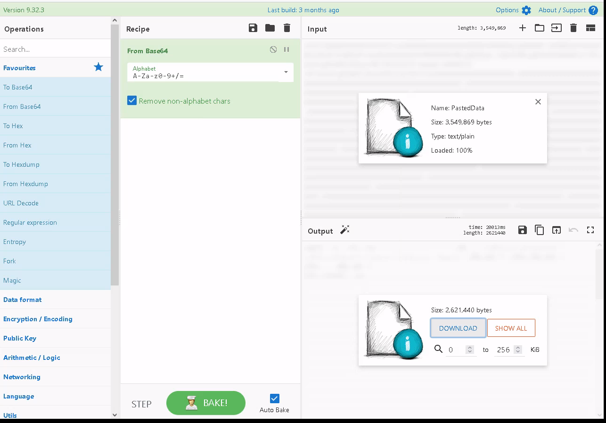

## Day 8

Today we get a special challenge by iconique sweet dude John Hammond. We're doing Windows forensics.  

>McSkidy was notified of some terrible news! Santa's laptop, which he uses to prepare his bag of toys for Christmas, is missing! We believe a minion at the Grinch Enterprise stole it, but we need to find out for sure. It is up to us to determine what actor compromised the laptop and recover Santa's bag of toys!

>Unfortunately, The Best Festival Company had minimal monitoring tools on Santa's laptop (he is the boss, after all)! All we have to work with are some PowerShell Transcription Logs we were able to remotely recover just after it went missing. 

We also get some commands for how to turn on PowerShell Transcription Logs in our own environment. A real Blue Team blessing:

    reg add HKEY_LOCAL_MACHINE\Software\Policies\Microsoft\Windows\PowerShell\Transcription /v EnableTranscripting /t REG_DWORD /d 0x1 /f
    reg add HKEY_LOCAL_MACHINE\Software\Policies\Microsoft\Windows\PowerShell\Transcription /v OutputDirectory /t REG_SZ /d C:/ /f
    reg add HKEY_LOCAL_MACHINE\Software\Policies\Microsoft\Windows\PowerShell\Transcription /v EnableInvocationHeader /t REG_DWORD /d 0x1 /f

Let's open the first log. We get a bunch of information about the shell and then we get into some commands.  

The Grinch's minions very reasonably started by running `whoami`, `systeminfo`, and `net user`. This gives an attacker a bunch of useful info very quickly. Looks like Santa's an early adopter, running Windows 11 on his laptop. Let's open the second log. We can see they created a new user and added them to the Administrator group.  

In the next log, we can see the Grinch's minion grabbed santa's UsrClass.dat file and encoded it using `certutil`.  

    certutil.exe -encode .\UsrClass.dat santa.dat

Certutil encodes into base64 by default, so let's decode that using CyberChef.  

What's UsrClass.dat? John Explains It All:

> The UsrClass.dat file contains "Shellbags," or artifacts contained within the Windows registry that store user preferences while viewing folders within the Windows Explorer GUI.

And we graciously get some [extra reading](https://shehackske.medium.com/windows-shellbags-part-1-9aae3cfaf17). We love to learn.  

If you try opening the .dat file we can download from CyberChef after its decoded, it'll just be a whole mess of unintelligible computer nonsense. That's just the computer trying to interpret non-text data as text. Instead, we can peak inside the ShellBagsExplorer folder and use that to interpret the file for us.  

Once we go to File > Load offline hive and load in our downloaded file, we see that Shellbags Explorer has found some goodies:

Moving through the folders, we see a folder called SantaRat on the Desktop. Inside SantaRat is a "SantaRat-main" folder and even better, a .github folder. This indicates the Grinch's minion might've downloaded what we'll assume is a Remote Access Trojan from Github.  

Let's have a google. We turn up [some pretty compelling evidence.](https://github.com/Grinchiest/SantaRat)

Moving through the user's other git repos, we see another project.  

Oh dang. Going back to our transcription logs, we can see the Grinchmen (Grinch henchmen?) used a compression tool to put all the "new" "toys" into a password-protected archive. These are just almost empty files; all they contain is the word "GRINCHMAS".  

Sometimes while people are in the middle of developing a project, they aren't always paying attention to where they're keeping the passwords or tokens included in the program. If they're not on top of it, sometimes they'll accidentally upload it to Github, and while they might then make a new commit removing those secrets, you might still be able to find them in the commit history. So let's look there:

Hmmmm, looks like we can expand the commit message for commit 4161546:

Now we can open the locked archive on the Desktop, bag_of_toys.zip, and retrieve all the original toys for Santa to deliver on Christmas.

Gosh, you wake up on Christmas morning to a bunch of presents and it seems effortless. Now we're starting to get a sense of just how much work goes into delivering them each year ;)