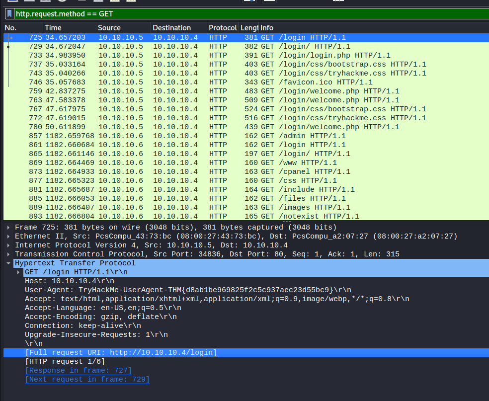
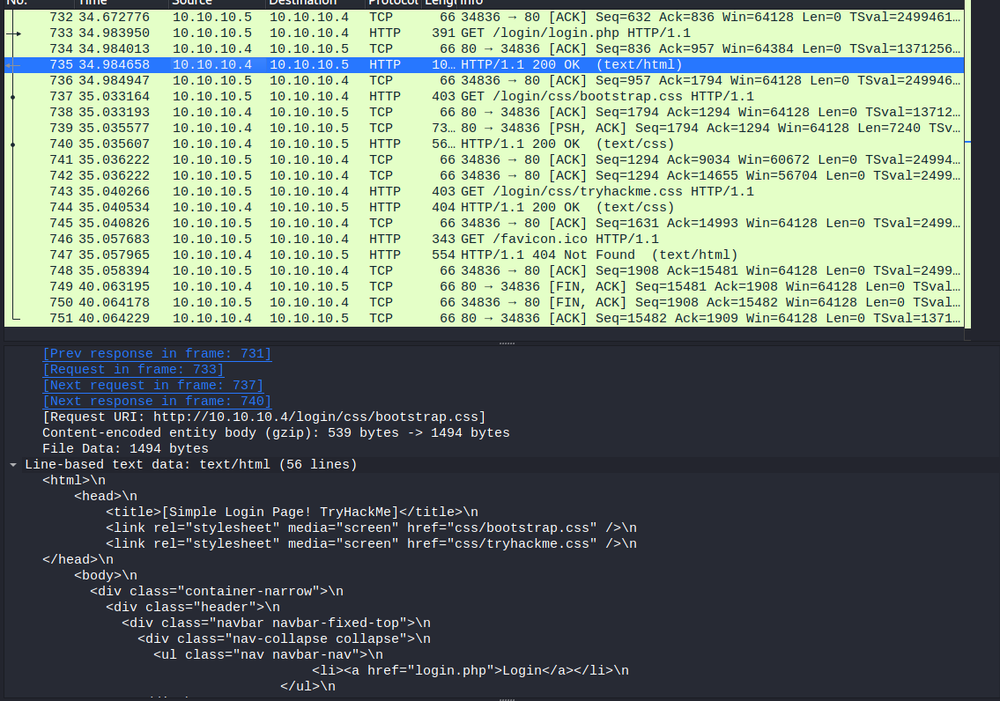
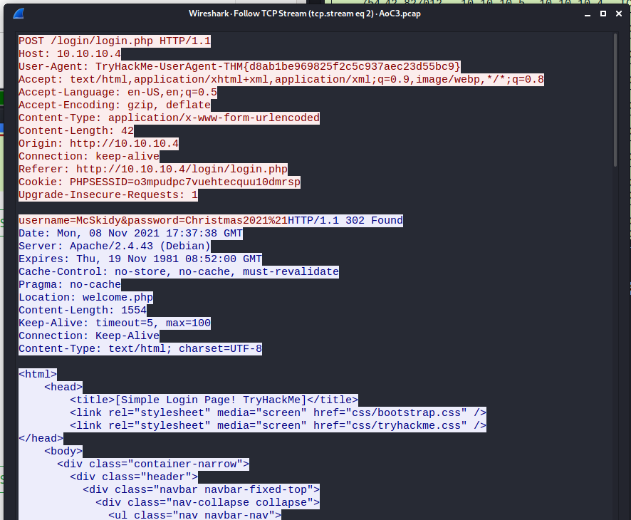
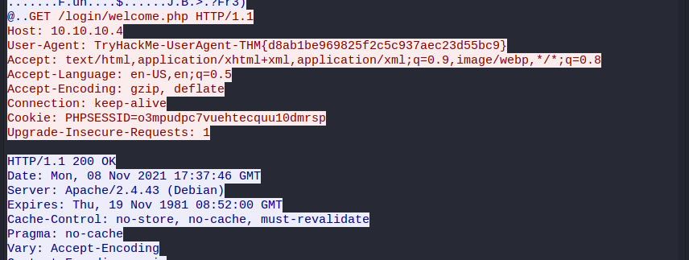
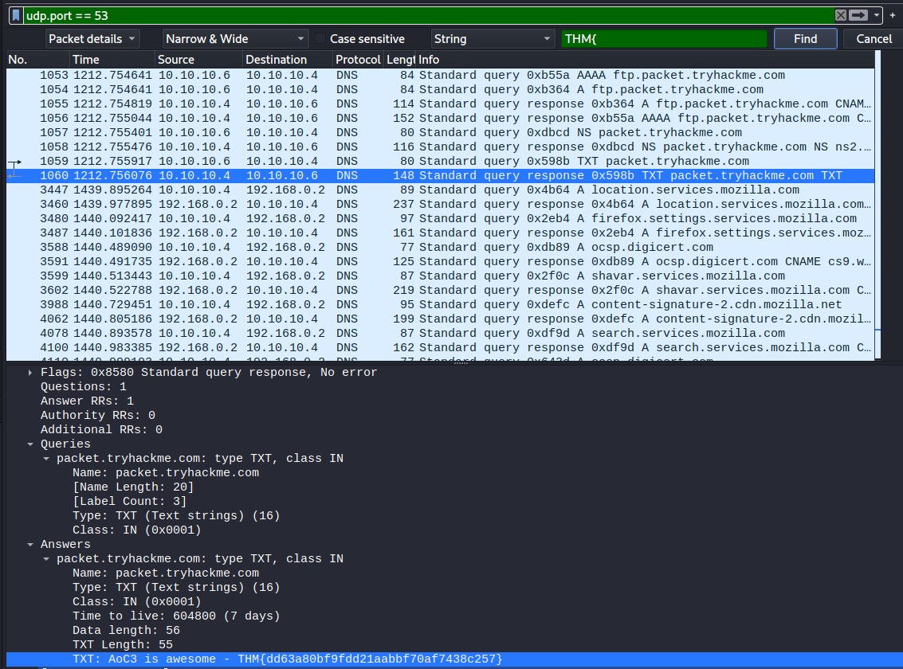
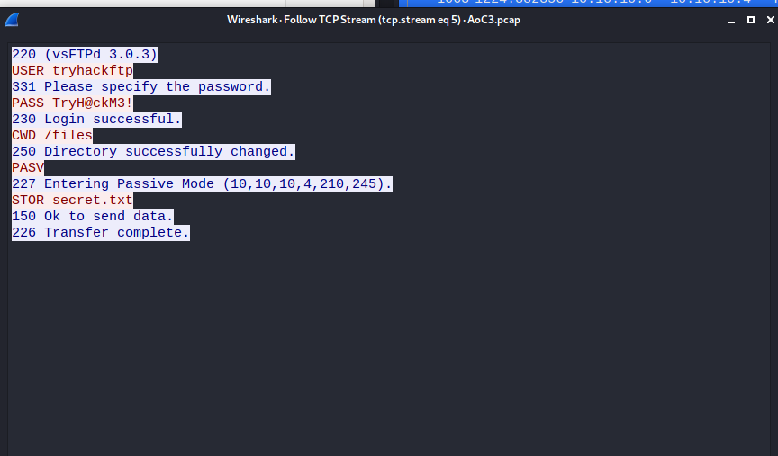

## Day 9

> McSkidy recently found out that a large amount of traffic is entering one system on the network. Use your traffic analysis skills to determine what kind of activities Grinch Enterprises are performing.

Traffic analysis. That's right. The way your computer sends data to mine is elaborate, a whole field of study, and part of that study is inspecting every little packet of data to see what they're saying to each other and how. I love networking, which is why I minored in it at university and have spent more time reading CCNA materials in the past couple years than any work of fiction. I always thought knowing this stuff was a huge boon to my adventures in pentesting. Today, that's validated again:

> We’re assuming that the user has basic background skills to complete this task, requires theoretical and practical knowledge, including basic networking concepts, TCP/IP Stack, OSI Model, and TCP handshake.

That's kind of a lot for a beginner, so don't feel bad if you're a little lost. It's important to know that entry-level cybersecurity is far, far from entry-level computing. There's a lot to take in. Learning to love feeling like a noob is the most valuable skill you'll hone.  

Let's dive in.  

> Which directory is found on the web server?  

There's a ton of packets here. Blessedly, Wireshark let's you set filters to whittle it down to only what you're interested in. You can set capture filters at the time of capture, or display filters after the fact to hide all the irrelevant stuff. Here's one for finding GET requests which is what we want now:

    http.request.method == GET

Up top we can see a user at IP 10.10.10.5 visited the web server at 10.10.10.4 and went to the /login page. Down the bottom when we select a packet, we can see the actual request body. Wireshark helpfully links to the response to that request too, so we can actually follow a user's journey. After going to the login page, the site redirected the user to the proper page (/login/). In the ensuing packets, we can actually read the page's HTML and CSS and see what other resources it's grabbing when it loads (like external CSS documents.)  

We can also right click on a packet and follow the stream instead of doing it manually. Wireshark will chain related packets together so we can get a better sense of that journey.  

Here we can see the start of one stream. McSkidy is putting their details into the login form.  

(I know, you're freaking out right now. You can SEE other people's PASSWORDS? What's the point of them then? This is why you've probably seen your browser making a big deal in the last few years out of the lock icon in the address bar and heard a lot about "https". Right now we're looking at HTTP traffic; HTTPS is encrypted. Viewing HTTPS in Wireshark, it's all absolutely garbled, impossible to extract your passwords from. Remember when I said the internet is fundamentally built on trust? That's why this is so easy.)  

At the bottom of the same stream, we can see the login has happened and McSkidy is redirected to the welcome page:

We can answer the next couple questions based on what we've got:

> What is the username and password used in the login page in the HTTP #2 - POST section? 

    McSkidy::Christmas2021!  

And:

> What is the User-Agent's name that has been sent in HTTP #2 - POST section?

    TryHackMe-UserAgent-THM{d8ab1be969825f2c5c937aec23d55bc9}

But for the next one, we need a new display filter.  

> In the DNS section, there is a TXT DNS query. What is the flag in the message of that DNS query?

DNS runs on UDP port 53, so we'll use:

    udp.port == 53

Now we have to find the flag. The sucker way is to follow the UDP streams with your eyes peeled. But why look when you can search? We know the format of the flag means it's going to start with something like "THM{" so let's:

1. Hit Ctrl + F
2. Type "THM{"
3. Change "Display Filter" to "String"
4. Change "Packet list" to "Packet details"

This is in stream 77, so doing it the manual way you would've had to look through 76 streams first and hope your eyes hadn't glazed over when it got to this one.  

The final questions are FTP ones:

> In the FTP section, what is the FTP login password?

> In the FTP section, what is the content of the secret.txt file?

We have a couple of display filter choices that do the same thing:

    tcp.port == 21
    ftp-data

If we follow the TCP stream for the first packet we see after the filter is applied, we get this sweet stuff:

We got a user logging in to FTP and transferring a file, secret.txt. Guess what's on the very next stream? The contents of secret.txt. Not so secret now.  

So what, never transfer anything via FTP? Well, it's the same as before: when these basic protocols for transferring files were created, it was still a miracle that a college campus in one state could read a file at a college campus in another. FTP debuted in 1971. When Kurt Cobain died, FTP was old enough to have had an authentically mascara-streaked sob under a bedroom poster of him. FTP is so old, it could've seen the original Star Wars in cinemas. Oh, it's insecure? Leave it alone, it did its best for the time.  

Now that we know the internet isn't as trustworthy as it was designed to be, like HTTPS, there's an updated protocol called SFTP (SSH File Transfer Protocol or Secure File Transfer Protocol, nobody makes up their minds about this stuff) which uses a similar encryption method to secure file transfers. And like HTTPS, SFTP is basically a default for end-users now (although server admins still can and do mess this up.)  

The internet is slowly getting more secure for most people without them having to do anything. That's the best part. 

