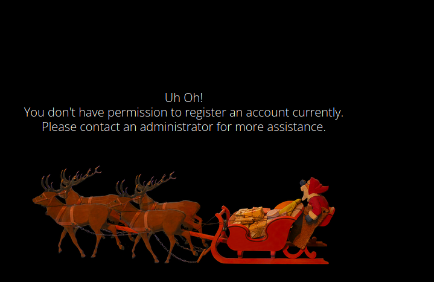
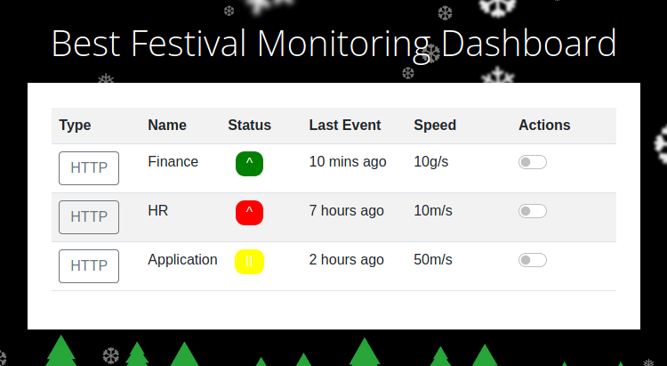

# Day 2

Today we're hacking for good, taking back the interdepartmental monitoring dashboard from The Grinch's attack:

> McSkidy needs to check if any other employee elves have left/been affected by Grinch Industries attack, but the systems that hold the employee information have been hacked. Can you hack them back to determine if the other teams in the Best Festival Company have been affected?

We're gonna bypassing a login page using cookies. A wonderful demonstration of why handling authorisation on the client side isn't a good idea.

> Register an account, and verify the cookies using the Developer Tools in your browser. What is the name of the new cookie that was created for your account?

Once we register an account, we get told:



Dang. Let's see if we can change this. We can press F12 to open our browser developer tools and go to the Storage tab. This is where our cookies are held. The site has created one called "user-auth":

```
user-auth: 7b636f6d70616e793a2022546865204265737420466573746976616c20436f6d70616e79222c206973726567697374657265643a2254727565222c20757365726e616d653a2262696e67626f6e67227d
```

Sometimes these cookies are just randomly generated strings. This isn't especially secure, but it does provide a barrier at least; if you want to impersonate an admin via a cookie, you have to guess or find that specific string. In our case though, the "user-auth" cookie is actually encoded data.

If we put the string into CyberChef, we decode it from hexadecimal to a JSON string:

```
https://gchq.github.io/CyberChef/

{company: "The Best Festival Company", isregistered:"True", username:"bingbong"}
```

This data is formatted in JSON (JavaScript Object Notation), a standardised way of presenting data on the web, and that's the username I put in when I registered. Let's alter the "username" field and re-encode it back to hexadecimal:

```
{company: "The Best Festival Company", isregistered:"True", username:"admin"}

7b636f6d70616e793a2022546865204265737420466573746976616c20436f6d70616e79222c206973726567697374657265643a2254727565222c20757365726e616d653a2261646d696e227d
```

If I go back to the website and paste this string into the user-auth cookie using the developer tools, the website will read it and believe I'm the "admin" user now. So if we log in with the email and password we registered before we should...



...now have access to the admin dashboard.
